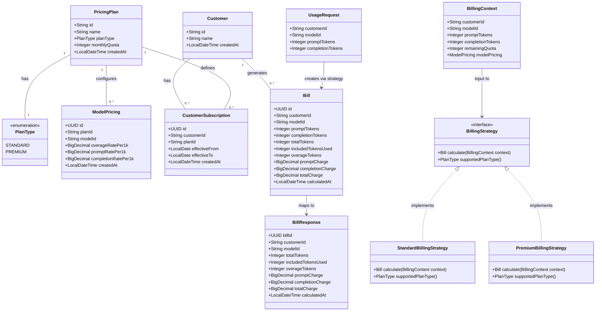

# Multi-Plan Billing Foundation & Model-Aware Pricing Implementation

## Requirements

Refactor the existing billing engine to support multiple subscription strategies (Standard, Premium) and variable pricing based on the AI model invoked. The system must route billing calculations to appropriate strategies based on plan type, apply model-specific rates, and return itemized billing breakdowns. This lays the foundation for future complex billing plans by implementing an extensible Strategy Pattern architecture.

**Key Capabilities:**
- Add required `modelId` field to usage submission
- Implement Standard Plan: quota-first consumption with model-aware overage rates
- Implement Premium Plan: no quota, separate prompt/completion billing with model-specific rates
- Return detailed charge breakdowns including prompt charge, completion charge, and model information

## Entities



## Approach

1. **Schema Evolution**:
   - Add `plan_type VARCHAR(20)` column to `pricing_plans` table with default 'STANDARD'
   - Create `model_pricing` table for model-specific rates per plan
   - Add `model_id VARCHAR(50)`, `prompt_charge DECIMAL(10,2)`, `completion_charge DECIMAL(10,2)` columns to `bills` table (nullable for backward compatibility)
   - Migrate existing pricing plans to have explicit model pricing entries

2. **Strategy Pattern Implementation**:
   - Define `BillingStrategy` interface with `calculate(BillingContext)` and `supportedPlanType()` methods
   - Implement `StandardBillingStrategy`: quota-first consumption, model-aware overage calculation
   - Implement `PremiumBillingStrategy`: no quota, split prompt/completion billing
   - Use Spring `@Component` with `@Qualifier` for strategy registration

3. **Strategy Resolution**:
   - Create `BillingStrategyFactory` that maps `PlanType` to `BillingStrategy` bean
   - Inject all strategies via constructor, build lookup map on initialization
   - Resolve strategy at runtime based on customer's plan type

4. **Model Pricing Resolution**:
   - Create `ModelPricingRepository` interface and JPA implementation
   - Query by (planId, modelId) to get applicable rates
   - Fail with HTTP 400 if model pricing not configured for the requested model

5. **Domain Model Updates**:
   - Add `PlanType` enum (STANDARD, PREMIUM)
   - Update `PricingPlan` domain entity to include `planType` (remove `overageRatePer1k` - now in ModelPricing)
   - Create `ModelPricing` domain entity for rate storage
   - Update `Bill` domain entity with `modelId`, `promptCharge`, `completionCharge`
   - Create `BillingContext` as value object for strategy input

6. **Service Layer Refactoring**:
   - `BillingServiceImpl.calculateBill()` orchestrates:
     1. Validate customer exists
     2. Resolve active subscription → pricing plan with plan type
     3. Resolve model pricing for (plan, modelId)
     4. Calculate remaining quota (only for Standard plans)
     5. Build `BillingContext` with all required data
     6. Delegate to appropriate `BillingStrategy`
     7. Persist and return bill

7. **DTO Updates**:
   - Add `@NotNull modelId` to `UsageRequest`
   - Add `modelId`, `promptCharge`, `completionCharge` to `BillResponse`

8. **Exception Handling**:
   - Add `ModelPricingNotFoundException` for unknown model scenarios
   - Return HTTP 400 with message "Pricing not configured for model: {modelId}"

## Structure

### Design Principles

1. **Strategy Pattern for Billing Calculations**: Encapsulate different billing algorithms (Standard, Premium) as interchangeable strategies. The service layer delegates to the appropriate strategy based on plan type, enabling easy addition of new billing models without modifying existing code.

2. **Three-Layer Architecture with Decoupled Models**: Maintain the existing clean separation:
   - Controllers handle HTTP concerns
   - Services orchestrate business logic and strategy selection
   - Repositories abstract data access
   - Domain entities remain framework-agnostic

3. **Dependency Inversion Principle**: 
   - Service depends on `BillingStrategy` interface, not concrete implementations
   - Strategy implementations depend on abstractions (ModelPricing, BillingContext)
   - Factory pattern abstracts strategy resolution

### Inheritance Relationships

1. `StandardBillingStrategy` implements `BillingStrategy` for quota-based billing
2. `PremiumBillingStrategy` implements `BillingStrategy` for split-rate billing
3. `ModelPricingNotFoundException` extends `RuntimeException` for pricing lookup failures
4. `PlanType` is an enum (STANDARD, PREMIUM) - no inheritance needed
5. Domain entities remain pure Java objects (no JPA inheritance)
6. Persistence Objects use discriminator column (`plan_type`) - not JPA inheritance

### Dependencies

1. `UsageController` depends on `BillingService` interface (unchanged)
2. `BillingServiceImpl` depends on:
   - `CustomerRepository`, `CustomerSubscriptionRepository`, `BillRepository` (existing)
   - `ModelPricingRepository` (new)
   - `BillingStrategyFactory` (new)
3. `BillingStrategyFactory` depends on `List<BillingStrategy>` (Spring auto-injects all implementations)
4. `StandardBillingStrategy` and `PremiumBillingStrategy` are stateless Spring components
5. `GlobalExceptionHandler` handles `ModelPricingNotFoundException` (new handler)

### Layered Architecture Updates

1. **Domain Layer** (`domain`):
   - Add `PlanType` enum
   - Add `ModelPricing` entity
   - Add `BillingContext` value object
   - Update `PricingPlan` (add planType, remove overageRatePer1k)
   - Update `Bill` (add modelId, promptCharge, completionCharge)

2. **Service Layer** (`service`):
   - Add `BillingStrategy` interface
   - Add `strategy/StandardBillingStrategy` implementation
   - Add `strategy/PremiumBillingStrategy` implementation
   - Add `BillingStrategyFactory`
   - Update `BillingServiceImpl` to use strategies

3. **Repository Layer** (`repository`):
   - Add `ModelPricingRepository` interface

4. **Infrastructure Layer** (`infrastructure/persistence`):
   - Add `ModelPricingPO` persistence object
   - Add `SpringDataModelPricingRepository`
   - Add `JpaModelPricingRepositoryAdapter`
   - Add `ModelPricingMapper`
   - Update `PricingPlanPO` (add planType column)
   - Update `BillPO` (add modelId, promptCharge, completionCharge)
   - Update `PricingPlanMapper`, `BillMapper`

5. **Exception Layer** (`exception`):
   - Add `ModelPricingNotFoundException`
   - Update `GlobalExceptionHandler`

## Operations

### Create Database Migration V2

1. Responsibility: Schema evolution for multi-plan billing support
2. Location: `src/main/resources/db/migration/V2__Add_model_pricing.sql`
3. SQL Operations:
   ```sql
   -- Add plan_type to pricing_plans
   ALTER TABLE pricing_plans ADD COLUMN plan_type VARCHAR(20) NOT NULL DEFAULT 'STANDARD';
   
   -- Create model_pricing table
   CREATE TABLE model_pricing (
       id UUID PRIMARY KEY,
       plan_id VARCHAR(50) NOT NULL REFERENCES pricing_plans(id),
       model_id VARCHAR(50) NOT NULL,
       overage_rate_per_1k DECIMAL(10, 4),
       prompt_rate_per_1k DECIMAL(10, 4),
       completion_rate_per_1k DECIMAL(10, 4),
       created_at TIMESTAMP NOT NULL DEFAULT CURRENT_TIMESTAMP,
       UNIQUE(plan_id, model_id)
   );
   
   -- Add model_id and charge breakdown to bills
   ALTER TABLE bills ADD COLUMN model_id VARCHAR(50);
   ALTER TABLE bills ADD COLUMN prompt_charge DECIMAL(10, 2);
   ALTER TABLE bills ADD COLUMN completion_charge DECIMAL(10, 2);
   
   -- Create index for model pricing lookup
   CREATE INDEX idx_model_pricing_plan_model ON model_pricing(plan_id, model_id);
   
   -- Migrate existing plan overage rates to model_pricing for common models
   INSERT INTO model_pricing (id, plan_id, model_id, overage_rate_per_1k)
   SELECT gen_random_uuid(), id, 'fast-model', overage_rate_per_1k FROM pricing_plans;
   
   INSERT INTO model_pricing (id, plan_id, model_id, overage_rate_per_1k)
   SELECT gen_random_uuid(), id, 'reasoning-model', overage_rate_per_1k FROM pricing_plans;
   
   -- Add a Premium plan for testing
   INSERT INTO pricing_plans (id, name, monthly_quota, overage_rate_per_1k, plan_type) VALUES
       ('PLAN-PREMIUM', 'Premium', 0, 0, 'PREMIUM');
   
   -- Add Premium plan model pricing (prompt/completion rates)
   INSERT INTO model_pricing (id, plan_id, model_id, prompt_rate_per_1k, completion_rate_per_1k) VALUES
       (gen_random_uuid(), 'PLAN-PREMIUM', 'fast-model', 0.01, 0.02),
       (gen_random_uuid(), 'PLAN-PREMIUM', 'reasoning-model', 0.03, 0.06);
   
   -- Add a Premium customer for testing
   INSERT INTO customers (id, name) VALUES
       ('CUST-PREMIUM', 'Premium Test Corp');
   
   -- Add Premium customer subscription
   INSERT INTO customer_subscriptions (id, customer_id, plan_id, effective_from) VALUES
       ('d4e5f6a7-b8c9-0123-def0-456789abcdef', 'CUST-PREMIUM', 'PLAN-PREMIUM', '2026-01-01');
   ```
4. Notes: Existing `overage_rate_per_1k` column in `pricing_plans` is retained for backward compatibility but superseded by `model_pricing`

### Create Enum - PlanType

1. Responsibility: Discriminator for billing strategy selection
2. Location: `domain/PlanType.java`
3. Values:
   - `STANDARD` - Quota-based billing with model-aware overage
   - `PREMIUM` - No quota, split prompt/completion billing
4. Notes: Simple enum, no additional methods needed

### Create Domain Entity - ModelPricing

1. Responsibility: Rate configuration for a specific model within a plan
2. Location: `domain/ModelPricing.java`
3. Attributes:
   - `id`: UUID - Pricing configuration identifier
   - `planId`: String - Reference to pricing plan
   - `modelId`: String - AI model identifier (e.g., "fast-model", "reasoning-model")
   - `overageRatePer1k`: BigDecimal - Rate for overage tokens (Standard plans), nullable
   - `promptRatePer1k`: BigDecimal - Rate for prompt tokens (Premium plans), nullable
   - `completionRatePer1k`: BigDecimal - Rate for completion tokens (Premium plans), nullable
   - `createdAt`: LocalDateTime - Creation timestamp
4. Notes: No JPA annotations - pure Java POJO

### Create Value Object - BillingContext

1. Responsibility: Encapsulate all inputs needed for billing calculation
2. Location: `domain/BillingContext.java`
3. Attributes:
   - `customerId`: String - Customer identifier
   - `modelId`: String - AI model used
   - `promptTokens`: int - Prompt token count
   - `completionTokens`: int - Completion token count
   - `remainingQuota`: int - Remaining monthly quota (0 for Premium plans)
   - `modelPricing`: ModelPricing - Applicable rates
4. Notes: Immutable value object using Lombok `@Value` or `@Builder`

### Update Domain Entity - PricingPlan

1. Responsibility: Add plan type discriminator
2. Location: `domain/PricingPlan.java`
3. Changes:
   - Add attribute `planType`: PlanType - Determines billing strategy
   - Keep `monthlyQuota` (0 for Premium plans)
   - Keep `overageRatePer1k` for backward compatibility (deprecated, use ModelPricing)
4. Notes: Update builder pattern to include planType

### Update Domain Entity - Bill

1. Responsibility: Add model info and charge breakdown
2. Location: `domain/Bill.java`
3. Changes:
   - Add attribute `modelId`: String - AI model used for this bill
   - Add attribute `promptCharge`: BigDecimal - Charge for prompt tokens (Premium only), nullable
   - Add attribute `completionCharge`: BigDecimal - Charge for completion tokens (Premium only), nullable
   - Deprecate static `create()` method - billing logic moves to strategies
4. New Factory Method:
   - `static createStandard(String customerId, String modelId, int promptTokens, int completionTokens, int remainingQuota, BigDecimal overageRatePer1k)`: Bill
     - Logic: Existing quota-first calculation, set promptCharge/completionCharge to null
   - `static createPremium(String customerId, String modelId, int promptTokens, int completionTokens, BigDecimal promptRatePer1k, BigDecimal completionRatePer1k)`: Bill
     - Logic: Calculate prompt/completion charges separately, includedTokensUsed = 0, overageTokens = 0
5. Notes: Keep both factory methods in Bill domain entity; strategies call appropriate factory

### Create Interface - BillingStrategy

1. Responsibility: Contract for billing calculation algorithms
2. Location: `service/strategy/BillingStrategy.java`
3. Type: Interface
4. Methods:
   - `Bill calculate(BillingContext context)` - Calculate and return Bill
   - `PlanType supportedPlanType()` - Return the PlanType this strategy handles
5. Notes: No Spring annotations on interface

### Create Strategy - StandardBillingStrategy

1. Responsibility: Billing calculation for Standard (quota-based) plans
2. Location: `service/strategy/StandardBillingStrategy.java`
3. Annotations: `@Component`
4. Implements: `BillingStrategy`
5. Methods:
   - `calculate(BillingContext context)`: Bill
     - Logic:
       1. Extract promptTokens, completionTokens, remainingQuota from context
       2. Calculate totalTokens = promptTokens + completionTokens
       3. Calculate includedTokensUsed = min(totalTokens, max(remainingQuota, 0))
       4. Calculate overageTokens = totalTokens - includedTokensUsed
       5. Calculate totalCharge = (overageTokens / 1000) × context.modelPricing.overageRatePer1k
       6. Call `Bill.createStandard()` with calculated values
       7. Return Bill
   - `supportedPlanType()`: PlanType
     - Return `PlanType.STANDARD`
6. Notes: Stateless component, thread-safe

### Create Strategy - PremiumBillingStrategy

1. Responsibility: Billing calculation for Premium (split-rate) plans
2. Location: `service/strategy/PremiumBillingStrategy.java`
3. Annotations: `@Component`
4. Implements: `BillingStrategy`
5. Methods:
   - `calculate(BillingContext context)`: Bill
     - Logic:
       1. Extract promptTokens, completionTokens, modelPricing from context
       2. Calculate promptCharge = (promptTokens / 1000) × modelPricing.promptRatePer1k
       3. Calculate completionCharge = (completionTokens / 1000) × modelPricing.completionRatePer1k
       4. Calculate totalCharge = promptCharge + completionCharge
       5. Set includedTokensUsed = 0, overageTokens = 0 (no quota concept)
       6. Call `Bill.createPremium()` with calculated values
       7. Return Bill
   - `supportedPlanType()`: PlanType
     - Return `PlanType.PREMIUM`
6. Notes: Stateless component, thread-safe

### Create Factory - BillingStrategyFactory

1. Responsibility: Resolve appropriate BillingStrategy based on PlanType
2. Location: `service/strategy/BillingStrategyFactory.java`
3. Annotations: `@Component`
4. Dependencies: `List<BillingStrategy>` (Spring injects all implementations)
5. Attributes:
   - `strategyMap`: Map<PlanType, BillingStrategy> - Lookup map built on construction
6. Constructor:
   - `BillingStrategyFactory(List<BillingStrategy> strategies)`
     - Logic: Build map from PlanType → Strategy using each strategy's `supportedPlanType()`
7. Methods:
   - `getStrategy(PlanType planType)`: BillingStrategy
     - Logic: Lookup in map, throw IllegalArgumentException if not found (defensive, should never happen)
8. Notes: Initialized once at startup, O(1) lookup

### Create Persistence Object - ModelPricingPO

1. Responsibility: JPA entity mapping to `model_pricing` table
2. Location: `infrastructure/persistence/entity/ModelPricingPO.java`
3. Attributes:
   - `id`: UUID - Primary key
   - `planId`: String - Foreign key to pricing_plans
   - `modelId`: String - Model identifier
   - `overageRatePer1k`: BigDecimal - Overage rate (nullable)
   - `promptRatePer1k`: BigDecimal - Prompt rate (nullable)
   - `completionRatePer1k`: BigDecimal - Completion rate (nullable)
   - `createdAt`: LocalDateTime - Creation timestamp
4. Annotations: `@Entity`, `@Table(name = "model_pricing")`, `@Id`, `@Column`

### Update Persistence Object - PricingPlanPO

1. Responsibility: Add plan_type column mapping
2. Location: `infrastructure/persistence/entity/PricingPlanPO.java`
3. Changes:
   - Add attribute `planType`: String - Maps to `plan_type` column
4. Annotations: `@Column(name = "plan_type", length = 20, nullable = false)`

### Update Persistence Object - BillPO

1. Responsibility: Add model_id and charge breakdown columns
2. Location: `infrastructure/persistence/entity/BillPO.java`
3. Changes:
   - Add `modelId`: String - Maps to `model_id` column (nullable)
   - Add `promptCharge`: BigDecimal - Maps to `prompt_charge` column (nullable)
   - Add `completionCharge`: BigDecimal - Maps to `completion_charge` column (nullable)
4. Annotations: `@Column` with appropriate naming and precision

### Create Mapper - ModelPricingMapper

1. Responsibility: Convert between ModelPricingPO and ModelPricing domain entity
2. Location: `infrastructure/persistence/mapper/ModelPricingMapper.java`
3. Methods:
   - `toDomain(ModelPricingPO po)`: ModelPricing

### Update Mapper - PricingPlanMapper

1. Responsibility: Handle planType conversion
2. Location: `infrastructure/persistence/mapper/PricingPlanMapper.java`
3. Changes:
   - Update `toDomain()` to convert String planType to PlanType enum
4. Logic: `PlanType.valueOf(po.getPlanType())`

### Update Mapper - BillMapper

1. Responsibility: Handle new Bill fields
2. Location: `infrastructure/persistence/mapper/BillMapper.java`
3. Changes:
   - Update `toDomain()` to include modelId, promptCharge, completionCharge
   - Update `toPO()` to include modelId, promptCharge, completionCharge

### Create Repository Interface - ModelPricingRepository

1. Responsibility: Define data-access contract for ModelPricing entities
2. Location: `repository/ModelPricingRepository.java`
3. Type: Interface (no Spring annotations)
4. Methods:
   - `findByPlanIdAndModelId(String planId, String modelId)`: Optional<ModelPricing>

### Create Spring Data Interface - SpringDataModelPricingRepository

1. Responsibility: Internal Spring Data JPA interface for ModelPricingPO
2. Location: `infrastructure/persistence/SpringDataModelPricingRepository.java`
3. Interface: `extends JpaRepository<ModelPricingPO, UUID>`
4. Methods:
   - `Optional<ModelPricingPO> findByPlanIdAndModelId(String planId, String modelId)`

### Create JPA Repository - JpaModelPricingRepositoryAdapter

1. Responsibility: Spring Data JPA implementation of ModelPricingRepository
2. Location: `infrastructure/persistence/JpaModelPricingRepositoryAdapter.java`
3. Annotations: `@Repository`
4. Dependencies: `SpringDataModelPricingRepository`, `ModelPricingMapper`
5. Implements: `ModelPricingRepository`
6. Methods:
   - `findByPlanIdAndModelId(String planId, String modelId)`: Optional<ModelPricing>
     - Logic: Delegate to Spring Data, map result using ModelPricingMapper.toDomain()

### Create Exception - ModelPricingNotFoundException

1. Responsibility: Thrown when model pricing not configured for plan+model combination
2. Location: `exception/ModelPricingNotFoundException.java`
3. Inheritance: extends RuntimeException
4. Attributes:
   - `planId`: String - The plan ID
   - `modelId`: String - The model ID that was not found
5. Constructors:
   - `ModelPricingNotFoundException(String planId, String modelId)`: Sets message "Pricing not configured for model: {modelId}"
6. HTTP Status: 400 Bad Request

### Update Exception Handler - GlobalExceptionHandler

1. Responsibility: Handle ModelPricingNotFoundException
2. Location: `exception/GlobalExceptionHandler.java`
3. Changes:
   - Add handler method:
     ```java
     @ExceptionHandler(ModelPricingNotFoundException.class)
     public ResponseEntity<ErrorResponse> handleModelPricingNotFoundException(ModelPricingNotFoundException ex) {
         log.error("Model pricing not found: planId={}, modelId={}", ex.getPlanId(), ex.getModelId());
         ErrorResponse errorResponse = ErrorResponse.of("BAD_REQUEST", ex.getMessage());
         return ResponseEntity.status(HttpStatus.BAD_REQUEST).body(errorResponse);
     }
     ```

### Update DTO - UsageRequest

1. Responsibility: Add required modelId field
2. Location: `dto/UsageRequest.java`
3. Changes:
   - Add attribute `modelId`: String - `@NotNull(message = "Model ID is required")`
4. Notes: Validation ensures modelId is present before service layer

### Update DTO - BillResponse

1. Responsibility: Add model info and charge breakdown
2. Location: `dto/BillResponse.java`
3. Changes:
   - Add `modelId`: String
   - Add `promptCharge`: BigDecimal (nullable, populated for Premium plans)
   - Add `completionCharge`: BigDecimal (nullable, populated for Premium plans)
4. Update `fromBill(Bill bill)`:
   - Map modelId, promptCharge, completionCharge from Bill

### Update Service Implementation - BillingServiceImpl

1. Responsibility: Orchestrate strategy-based billing
2. Location: `service/impl/BillingServiceImpl.java`
3. Changes:
   - Add dependency: `ModelPricingRepository` (injected via constructor)
   - Add dependency: `BillingStrategyFactory` (injected via constructor)
4. Updated `calculateBill(UsageRequest request)` method:
   - Logic:
     1. Extract customerId, modelId, promptTokens, completionTokens from request
     2. Call `validateCustomerExists(customerId)`
     3. Call `resolveActivePricingPlan(customerId)` → get PricingPlan with planType
     4. Call `resolveModelPricing(plan.getId(), modelId)` → get ModelPricing
     5. Call `calculateRemainingQuota(customerId, plan)` → get remainingQuota (returns 0 for Premium)
     6. Build `BillingContext` with all data
     7. Get strategy via `billingStrategyFactory.getStrategy(plan.getPlanType())`
     8. Call `strategy.calculate(context)` → get Bill
     9. Log billing result
     10. Save and return Bill
5. New private method `resolveModelPricing(String planId, String modelId)`: ModelPricing
   - Logic: Query ModelPricingRepository, throw ModelPricingNotFoundException if not found
6. Update `calculateRemainingQuota()`:
   - If plan.monthlyQuota == 0, return 0 (Premium plans have no quota)

## Norms

1. **Package Structure** (Extended for Strategy Pattern):
   - `org.tw.token_billing.service.strategy` - Billing strategy interface and implementations
   - All other packages remain unchanged from existing structure

2. **Strategy Pattern Conventions**:
   - Strategy interface in `service.strategy` package
   - Strategy implementations as `@Component` beans
   - Factory as `@Component` with constructor injection of all strategies
   - Strategies are stateless and thread-safe

3. **Enum Conventions**:
   - Enums in `domain` package
   - Simple enums without behavior (PlanType)
   - Database stores enum name as VARCHAR

4. **Nullable Fields**:
   - Use Java `BigDecimal` (nullable) for optional charge fields
   - Don't use `Optional` for entity fields (JPA compatibility)
   - Document nullability in comments

5. **Backward Compatibility**:
   - New columns added as nullable
   - Existing data continues to work with defaults
   - Migration seeds data for common models

6. **Annotation Standards** (Extended):
   - Strategy implementations: `@Component`
   - Factory: `@Component`
   - Enum: No annotations

7. **Naming Conventions** (Extended):
   - Strategies: `{PlanType}BillingStrategy` (StandardBillingStrategy, PremiumBillingStrategy)
   - Factory: `BillingStrategyFactory`
   - Context/Value Objects: Descriptive noun (BillingContext)
   - Enums: Singular noun (PlanType)

8. **Calculation Precision**:
   - All monetary calculations use BigDecimal
   - Intermediate calculations: scale 10, RoundingMode.HALF_UP
   - Final charges: scale 2, RoundingMode.HALF_UP
   - Same precision rules apply to all strategies

## Safeguards

1. **Functional Constraints**:
   - All existing functional constraints remain valid
   - Model ID must be provided in every usage request
   - Model pricing must be configured for the (plan, model) combination
   - Premium plans must have both prompt and completion rates configured
   - Standard plans must have overage rate configured for each model

2. **Input Validation Constraints**:
   - `modelId`: Required, non-null, non-empty
   - Validation message for missing modelId: "Model ID is required"
   - Existing validations for customerId, promptTokens, completionTokens remain

3. **Business Rule Constraints**:
   - Standard Plan: Same quota-first logic, but overage rate from model_pricing table
   - Premium Plan: No quota (monthlyQuota = 0), split billing for prompt/completion
   - Charge calculation formulas:
     - Standard overage: `(overageTokens / 1000) × modelPricing.overageRatePer1k`
     - Premium prompt: `(promptTokens / 1000) × modelPricing.promptRatePer1k`
     - Premium completion: `(completionTokens / 1000) × modelPricing.completionRatePer1k`

4. **Data Integrity Constraints**:
   - model_pricing.plan_id must reference valid pricing_plans.id
   - model_pricing (plan_id, model_id) combination must be unique
   - bills.model_id is nullable for backward compatibility with existing bills

5. **Strategy Pattern Constraints**:
   - Every PlanType must have exactly one BillingStrategy implementation
   - Strategies must be stateless (no instance state between calls)
   - BillingStrategyFactory must fail fast if strategy not found (defensive programming)

6. **Response Constraints**:
   - BillResponse must include modelId for all new bills
   - promptCharge and completionCharge are null for Standard plans
   - promptCharge and completionCharge are populated for Premium plans
   - includedTokensUsed = 0 for Premium plans
   - overageTokens = 0 for Premium plans

7. **HTTP Response Constraints** (Extended):
   - Model pricing not found: HTTP 400 with message "Pricing not configured for model: {modelId}"
   - All other error responses unchanged

8. **Migration Constraints**:
   - V2 migration must be idempotent (safe to re-run)
   - Existing pricing plans get plan_type = 'STANDARD' by default
   - Existing overage rates are copied to model_pricing for backward compatibility
   - Seed data includes 'fast-model' and 'reasoning-model' for all plans

9. **Test Data Constraints** (for ACs):
   - AC2 test setup: Standard plan customer with 100K quota, 90K used, fast-model @ $0.01/1K overage
   - AC3 test setup: Premium plan customer, reasoning-model @ $0.03/1K prompt, $0.06/1K completion
   - Seeded test customers:
     - `CUST-001`, `CUST-002`, `CUST-003` - Standard plan customers (from V1)
     - `CUST-PREMIUM` - Premium Test Corp with `PLAN-PREMIUM` subscription (from V2)

10. **Architecture Constraints** (Extended):
    - Strategies depend only on BillingContext value object (not on repositories)
    - BillingServiceImpl is the only class that interacts with repositories
    - Strategies contain only calculation logic, no I/O or side effects
