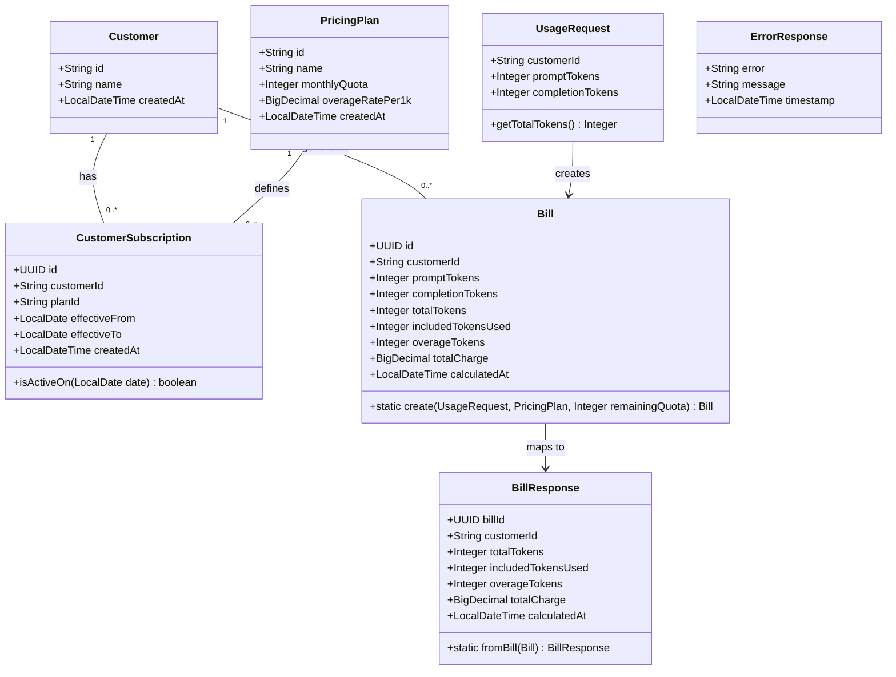

# Token Usage Billing API Implementation

## Requirements

Implement a billing calculation API that accepts token usage submissions, calculates charges based on quota-first consumption rules, and returns itemized bill details. The system must accurately bill LLM API customers by deducting usage from monthly included quotas before applying overage rates, ensuring revenue capture while providing transparent billing breakdowns.

## Entities



## Approach

1. **REST API Design**:
   - Single POST `/api/usage` endpoint accepting JSON payload
   - Request validation via Bean Validation annotations (`@Valid`, `@NotNull`, `@Min`)
   - HTTP 201 Created response with bill details on success
   - Standardized error responses for validation failures (400), not found (404), and business rule violations (422)

2. **Billing Calculation Strategy**:
   - Query-time aggregation for current month usage (correctness over performance)
   - Quota-first consumption: deduct from monthly quota before charging overage
   - BigDecimal arithmetic with HALF_UP rounding to 2 decimal places for charge calculation
   - Calendar month definition using UTC timezone for consistency

3. **Subscription Resolution**:
   - Find active subscription where current date falls within `effective_from` and `effective_to` (inclusive)
   - `effective_to = NULL` means subscription is active indefinitely
   - Fail explicitly with 422 if no active subscription found (safer for billing)

4. **Exception Handling Strategy**:
   - GlobalExceptionHandler with `@RestControllerAdvice` for unified error responses
   - Custom business exceptions extending RuntimeException
   - Structured ErrorResponse DTO for consistent client error format
   - Exception types: CustomerNotFoundException (404), NoActiveSubscriptionException (422), validation errors (400)

5. **Data Access Pattern** (Following Dependency Inversion):
   - Repository interfaces define data-access contracts in the repository package
   - Service layer depends only on repository interfaces (not implementations)
   - Infrastructure layer provides JPA repository adapters implementing the interfaces
   - Mappers convert between Domain entities and Persistence Objects (POs)
   - Custom query method in BillRepository interface for current month usage aggregation
   - Transactional service implementation for billing calculation and persistence

6. **Architecture Pattern** (Three-Layer with Decoupled Models):
   - Controller → Service Interface → Repository Interface (clean dependency flow)
   - Service Implementation and Repository Adapter implementations provided separately
   - Domain entities encapsulate business logic without infrastructure concerns
   - Persistence Objects handle database mapping in the infrastructure layer

## Structure

### Design Principles

1. **Three-Layer Architecture**: Adopt a clean Controller → Service → Repository layering. Each layer has a single responsibility:
   - Controllers handle HTTP concerns (request/response, validation, status codes)
   - Services encapsulate business logic (billing calculation, quota management)
   - Repositories abstract data access (persistence operations)

2. **Decoupled Models**: Strictly separate the Domain Model from the Persistence Model:
   - Domain layer encapsulates pure business logic with no infrastructure dependencies
   - Infrastructure layer handles data storage by mapping Domain Entities to Persistence Objects (POs)
   - Mappers convert between Domain and Persistence representations

3. **Dependency Inversion Principle**: Both the Service Layer and Repository Layer adhere to DIP:
   - Service Layer: Define Service interfaces that express business operations. Controllers depend only on these interfaces.
   - Repository Layer: Define Repository interfaces that express data-access contracts. Services depend strictly on these interfaces, and the infrastructure layer provides concrete implementations.

### Inheritance Relationships

1. `CustomerNotFoundException` extends `RuntimeException` for customer lookup failures
2. `NoActiveSubscriptionException` extends `RuntimeException` for subscription resolution failures
3. Domain entities are pure Java objects with business logic (no framework annotations)
4. Persistence Objects (POs) are JPA `@Entity` annotated classes for database mapping
5. Request/Response DTOs are simple data carriers with validation annotations

### Dependencies (Following Dependency Inversion)

1. `UsageController` depends on `BillingService` interface (not implementation)
2. `BillingServiceImpl` depends on `CustomerRepository`, `CustomerSubscriptionRepository`, `BillRepository` interfaces
3. Infrastructure layer provides `JpaCustomerRepository`, `JpaCustomerSubscriptionRepository`, `JpaBillRepository` implementations
4. `GlobalExceptionHandler` handles exceptions from all controllers

### Layered Architecture

1. **Controller Layer** (`controller`): HTTP request/response handling, input validation, delegates to service interfaces
2. **Service Layer** (`service`): Business logic orchestration, billing calculation, transaction management
   - `service/` - Service interfaces defining business operations
   - `service/impl/` - Concrete service implementations
3. **Domain Layer** (`domain`): Pure business entities with domain logic, no infrastructure dependencies
4. **Repository Layer** (`repository`): Repository interfaces defining data-access contracts
5. **Infrastructure Layer** (`infrastructure`): Concrete implementations of repository interfaces
   - `infrastructure/persistence/` - JPA repository implementations
   - `infrastructure/persistence/entity/` - Persistence Objects (POs) with JPA annotations
   - `infrastructure/persistence/mapper/` - Mappers between Domain and Persistence models
6. **DTO Layer** (`dto`): Request/Response objects for API contract
7. **Exception Layer** (`exception`): Custom exceptions and global handler for error responses

## Operations

### Create Domain Entity - Customer

1. Responsibility: Pure domain entity representing a customer (no infrastructure dependencies)
2. Location: `domain/Customer.java`
3. Attributes:
   - `id`: String - Customer identifier
   - `name`: String - Customer name
   - `createdAt`: LocalDateTime - Creation timestamp
4. Notes: No JPA annotations - pure Java POJO

### Create Domain Entity - PricingPlan

1. Responsibility: Pure domain entity representing a pricing plan (no infrastructure dependencies)
2. Location: `domain/PricingPlan.java`
3. Attributes:
   - `id`: String - Plan identifier
   - `name`: String - Plan name
   - `monthlyQuota`: Integer - Monthly included tokens
   - `overageRatePer1k`: BigDecimal - Rate per 1000 overage tokens
   - `createdAt`: LocalDateTime - Creation timestamp
4. Notes: No JPA annotations - pure Java POJO

### Create Domain Entity - CustomerSubscription

1. Responsibility: Pure domain entity representing a subscription with business logic
2. Location: `domain/CustomerSubscription.java`
3. Attributes:
   - `id`: UUID - Subscription identifier
   - `customerId`: String - Reference to customer
   - `plan`: PricingPlan - Associated pricing plan (domain reference)
   - `effectiveFrom`: LocalDate - Subscription start date
   - `effectiveTo`: LocalDate - Subscription end date (nullable, null = indefinite)
   - `createdAt`: LocalDateTime - Creation timestamp
4. Methods:
   - `isActiveOn(LocalDate date)`: boolean
     - Logic: Return true if date >= effectiveFrom AND (effectiveTo is null OR date <= effectiveTo)
5. Notes: No JPA annotations - pure Java POJO with domain logic

### Create Domain Entity - Bill

1. Responsibility: Pure domain entity with billing calculation logic
2. Location: `domain/Bill.java`
3. Attributes:
   - `id`: UUID - Bill identifier
   - `customerId`: String - Reference to customer
   - `promptTokens`: Integer - Input tokens submitted
   - `completionTokens`: Integer - Output tokens submitted
   - `totalTokens`: Integer - Sum of prompt + completion tokens
   - `includedTokensUsed`: Integer - Tokens deducted from quota
   - `overageTokens`: Integer - Tokens beyond quota
   - `totalCharge`: BigDecimal - Calculated charge
   - `calculatedAt`: LocalDateTime - Billing timestamp
4. Methods:
   - `static create(String customerId, int promptTokens, int completionTokens, int remainingQuota, BigDecimal overageRatePer1k)`: Bill
     - Logic:
       - Calculate totalTokens = promptTokens + completionTokens
       - Calculate includedTokensUsed = min(totalTokens, remainingQuota)
       - Calculate overageTokens = totalTokens - includedTokensUsed
       - Calculate totalCharge = (overageTokens / 1000.0) \* overageRatePer1k, rounded HALF_UP to 2 decimals
       - Set calculatedAt to current UTC time
       - Generate UUID for id
       - Return new Bill instance
5. Notes: No JPA annotations - pure Java POJO with factory method containing business logic

### Create Persistence Object - CustomerPO

1. Responsibility: JPA entity mapping to `customers` table
2. Location: `infrastructure/persistence/entity/CustomerPO.java`
3. Attributes:
   - `id`: String - Primary key (VARCHAR(50))
   - `name`: String - Customer name (VARCHAR(100))
   - `createdAt`: LocalDateTime - Creation timestamp
4. Annotations: `@Entity`, `@Table(name = "customers")`, `@Id`, `@Column`

### Create Persistence Object - PricingPlanPO

1. Responsibility: JPA entity mapping to `pricing_plans` table
2. Location: `infrastructure/persistence/entity/PricingPlanPO.java`
3. Attributes:
   - `id`: String - Primary key (VARCHAR(50))
   - `name`: String - Plan name (VARCHAR(100))
   - `monthlyQuota`: Integer - Monthly included tokens
   - `overageRatePer1k`: BigDecimal - Rate per 1000 overage tokens (DECIMAL(10,4))
   - `createdAt`: LocalDateTime - Creation timestamp
4. Annotations: `@Entity`, `@Table(name = "pricing_plans")`, `@Id`, `@Column`

### Create Persistence Object - CustomerSubscriptionPO

1. Responsibility: JPA entity mapping to `customer_subscriptions` table
2. Location: `infrastructure/persistence/entity/CustomerSubscriptionPO.java`
3. Attributes:
   - `id`: UUID - Primary key
   - `customerId`: String - Foreign key to customers
   - `planId`: String - Foreign key to pricing_plans
   - `effectiveFrom`: LocalDate - Subscription start date
   - `effectiveTo`: LocalDate - Subscription end date (nullable)
   - `createdAt`: LocalDateTime - Creation timestamp
4. Relationships: `@ManyToOne` to CustomerPO, `@ManyToOne` to PricingPlanPO
5. Annotations: `@Entity`, `@Table(name = "customer_subscriptions")`

### Create Persistence Object - BillPO

1. Responsibility: JPA entity mapping to `bills` table
2. Location: `infrastructure/persistence/entity/BillPO.java`
3. Attributes:
   - `id`: UUID - Primary key (generated)
   - `customerId`: String - Foreign key to customers
   - `promptTokens`: Integer - Input tokens submitted
   - `completionTokens`: Integer - Output tokens submitted
   - `totalTokens`: Integer - Sum of prompt + completion tokens
   - `includedTokensUsed`: Integer - Tokens deducted from quota
   - `overageTokens`: Integer - Tokens beyond quota
   - `totalCharge`: BigDecimal - Calculated charge (DECIMAL(10,2))
   - `calculatedAt`: LocalDateTime - Billing timestamp
4. Annotations: `@Entity`, `@Table(name = "bills")`, `@PrePersist` for id generation

### Create DTO - UsageRequest

1. Responsibility: Input DTO for POST /api/usage endpoint
2. Location: `dto/UsageRequest.java`
3. Attributes:
   - `customerId`: String - `@NotNull(message = "Customer ID is required")`
   - `promptTokens`: Integer - `@NotNull`, `@Min(value = 0, message = "Token count cannot be negative")`
   - `completionTokens`: Integer - `@NotNull`, `@Min(value = 0, message = "Token count cannot be negative")`
4. Methods:
   - `getTotalTokens()`: Integer - Returns promptTokens + completionTokens

### Create DTO - BillResponse

1. Responsibility: Output DTO for successful billing response
2. Location: `dto/BillResponse.java`
3. Attributes:
   - `billId`: UUID
   - `customerId`: String
   - `totalTokens`: Integer
   - `includedTokensUsed`: Integer
   - `overageTokens`: Integer
   - `totalCharge`: BigDecimal
   - `calculatedAt`: LocalDateTime
4. Methods:
   - `static fromBill(Bill bill)`: BillResponse
     - Logic: Map all fields from Bill domain entity to BillResponse

### Create DTO - ErrorResponse

1. Responsibility: Unified error response structure
2. Location: `dto/ErrorResponse.java`
3. Attributes:
   - `error`: String - Error type/code
   - `message`: String - Human-readable error message
   - `timestamp`: LocalDateTime - When error occurred
4. Constructors: All-args constructor, static factory method

### Create Mapper - CustomerMapper

1. Responsibility: Convert between Customer domain entity and CustomerPO
2. Location: `infrastructure/persistence/mapper/CustomerMapper.java`
3. Methods:
   - `toDomain(CustomerPO po)`: Customer - Convert PO to domain entity
   - `toPO(Customer domain)`: CustomerPO - Convert domain entity to PO

### Create Mapper - PricingPlanMapper

1. Responsibility: Convert between PricingPlan domain entity and PricingPlanPO
2. Location: `infrastructure/persistence/mapper/PricingPlanMapper.java`
3. Methods:
   - `toDomain(PricingPlanPO po)`: PricingPlan - Convert PO to domain entity
   - `toPO(PricingPlan domain)`: PricingPlanPO - Convert domain entity to PO

### Create Mapper - CustomerSubscriptionMapper

1. Responsibility: Convert between CustomerSubscription domain entity and CustomerSubscriptionPO
2. Location: `infrastructure/persistence/mapper/CustomerSubscriptionMapper.java`
3. Dependencies: `PricingPlanMapper` for nested plan conversion
3. Methods:
   - `toDomain(CustomerSubscriptionPO po, PricingPlan plan)`: CustomerSubscription - Convert PO to domain entity with resolved plan
   - `toPO(CustomerSubscription domain)`: CustomerSubscriptionPO - Convert domain entity to PO

### Create Mapper - BillMapper

1. Responsibility: Convert between Bill domain entity and BillPO
2. Location: `infrastructure/persistence/mapper/BillMapper.java`
3. Methods:
   - `toDomain(BillPO po)`: Bill - Convert PO to domain entity
   - `toPO(Bill domain)`: BillPO - Convert domain entity to PO

### Create Repository Interface - CustomerRepository

1. Responsibility: Define data-access contract for Customer entities (Dependency Inversion)
2. Location: `repository/CustomerRepository.java`
3. Type: Interface (no Spring annotations)
4. Methods:
   - `findById(String id)`: Optional<Customer> - Find customer by ID

### Create Repository Interface - CustomerSubscriptionRepository

1. Responsibility: Define data-access contract for CustomerSubscription entities (Dependency Inversion)
2. Location: `repository/CustomerSubscriptionRepository.java`
3. Type: Interface (no Spring annotations)
4. Methods:
   - `findActiveSubscriptions(String customerId, LocalDate date)`: List<CustomerSubscription> - Find active subscriptions for customer on date

### Create Repository Interface - BillRepository

1. Responsibility: Define data-access contract for Bill entities (Dependency Inversion)
2. Location: `repository/BillRepository.java`
3. Type: Interface (no Spring annotations)
4. Methods:
   - `save(Bill bill)`: Bill - Persist a bill
   - `sumIncludedTokensUsedForMonth(String customerId, LocalDateTime monthStart, LocalDateTime monthEnd)`: Integer - Sum included tokens for month

### Create JPA Repository - JpaCustomerRepositoryAdapter

1. Responsibility: Spring Data JPA implementation of CustomerRepository interface
2. Location: `infrastructure/persistence/JpaCustomerRepositoryAdapter.java`
3. Annotations: `@Repository`
4. Dependencies: `SpringDataCustomerRepository` (internal JPA interface), `CustomerMapper`
5. Implements: `CustomerRepository`
6. Methods:
   - `findById(String id)`: Optional<Customer>
     - Logic: Delegate to Spring Data, map result using CustomerMapper.toDomain()

### Create Spring Data Interface - SpringDataCustomerRepository

1. Responsibility: Internal Spring Data JPA interface for CustomerPO
2. Location: `infrastructure/persistence/SpringDataCustomerRepository.java`
3. Interface: `extends JpaRepository<CustomerPO, String>`
4. Notes: Internal to infrastructure layer, not exposed to domain/service layers

### Create JPA Repository - JpaCustomerSubscriptionRepositoryAdapter

1. Responsibility: Spring Data JPA implementation of CustomerSubscriptionRepository interface
2. Location: `infrastructure/persistence/JpaCustomerSubscriptionRepositoryAdapter.java`
3. Annotations: `@Repository`
4. Dependencies: `SpringDataCustomerSubscriptionRepository`, `SpringDataPricingPlanRepository`, `CustomerSubscriptionMapper`, `PricingPlanMapper`
5. Implements: `CustomerSubscriptionRepository`
6. Methods:
   - `findActiveSubscriptions(String customerId, LocalDate date)`: List<CustomerSubscription>
     - Logic: Query POs, resolve PricingPlan for each, map to domain using CustomerSubscriptionMapper

### Create Spring Data Interface - SpringDataCustomerSubscriptionRepository

1. Responsibility: Internal Spring Data JPA interface for CustomerSubscriptionPO
2. Location: `infrastructure/persistence/SpringDataCustomerSubscriptionRepository.java`
3. Interface: `extends JpaRepository<CustomerSubscriptionPO, UUID>`
4. Methods:
   - `@Query` annotation:
     ```java
     @Query("SELECT cs FROM CustomerSubscriptionPO cs WHERE cs.customerId = :customerId " +
            "AND cs.effectiveFrom <= :date AND (cs.effectiveTo IS NULL OR cs.effectiveTo >= :date) " +
            "ORDER BY cs.createdAt DESC")
     List<CustomerSubscriptionPO> findActiveSubscriptions(@Param("customerId") String customerId, @Param("date") LocalDate date);
     ```

### Create Spring Data Interface - SpringDataPricingPlanRepository

1. Responsibility: Internal Spring Data JPA interface for PricingPlanPO
2. Location: `infrastructure/persistence/SpringDataPricingPlanRepository.java`
3. Interface: `extends JpaRepository<PricingPlanPO, String>`

### Create JPA Repository - JpaBillRepositoryAdapter

1. Responsibility: Spring Data JPA implementation of BillRepository interface
2. Location: `infrastructure/persistence/JpaBillRepositoryAdapter.java`
3. Annotations: `@Repository`
4. Dependencies: `SpringDataBillRepository`, `BillMapper`
5. Implements: `BillRepository`
6. Methods:
   - `save(Bill bill)`: Bill
     - Logic: Map to PO using BillMapper, save via Spring Data, map result back to domain
   - `sumIncludedTokensUsedForMonth(String customerId, LocalDateTime monthStart, LocalDateTime monthEnd)`: Integer
     - Logic: Delegate to Spring Data query

### Create Spring Data Interface - SpringDataBillRepository

1. Responsibility: Internal Spring Data JPA interface for BillPO
2. Location: `infrastructure/persistence/SpringDataBillRepository.java`
3. Interface: `extends JpaRepository<BillPO, UUID>`
4. Methods:
   - Custom query for current month usage:
     ```java
     @Query("SELECT COALESCE(SUM(b.includedTokensUsed), 0) FROM BillPO b " +
            "WHERE b.customerId = :customerId " +
            "AND b.calculatedAt >= :monthStart AND b.calculatedAt < :monthEnd")
     Integer sumIncludedTokensUsedForMonth(@Param("customerId") String customerId,
                                           @Param("monthStart") LocalDateTime monthStart,
                                           @Param("monthEnd") LocalDateTime monthEnd);
     ```

### Create Exception - CustomerNotFoundException

1. Responsibility: Thrown when customer ID does not exist
2. Location: `exception/CustomerNotFoundException.java`
3. Inheritance: extends RuntimeException
4. Attributes:
   - `customerId`: String - The ID that was not found
5. Constructors:
   - `CustomerNotFoundException(String customerId)`: Sets message "Customer not found"
6. HTTP Status: 404 Not Found

### Create Exception - NoActiveSubscriptionException

1. Responsibility: Thrown when customer has no active subscription
2. Location: `exception/NoActiveSubscriptionException.java`
3. Inheritance: extends RuntimeException
4. Attributes:
   - `customerId`: String - The customer ID
5. Constructors:
   - `NoActiveSubscriptionException(String customerId)`: Sets message "No active subscription found"
6. HTTP Status: 422 Unprocessable Entity

### Create Exception Handler - GlobalExceptionHandler

1. Responsibility: Unified handling of all exceptions across controllers
2. Location: `exception/GlobalExceptionHandler.java`
3. Annotations: `@RestControllerAdvice`
4. Methods:
   - `handleCustomerNotFoundException(CustomerNotFoundException ex)`: ResponseEntity<ErrorResponse>
     - Logic: Return 404 with ErrorResponse containing "Customer not found"
   - `handleNoActiveSubscriptionException(NoActiveSubscriptionException ex)`: ResponseEntity<ErrorResponse>
     - Logic: Return 422 with ErrorResponse containing "No active subscription found"
   - `handleMethodArgumentNotValidException(MethodArgumentNotValidException ex)`: ResponseEntity<ErrorResponse>
     - Logic: Extract first validation error message, return 400 with ErrorResponse
   - `handleConstraintViolationException(ConstraintViolationException ex)`: ResponseEntity<ErrorResponse>
     - Logic: Return 400 with validation error message

### Create Service Interface - BillingService

1. Responsibility: Define business operations contract for billing (Dependency Inversion)
2. Location: `service/BillingService.java`
3. Type: Interface (no Spring annotations)
4. Methods:
   - `calculateBill(UsageRequest request)`: Bill - Calculate and persist a bill for the usage request

### Create Service Implementation - BillingServiceImpl

1. Responsibility: Concrete implementation of billing business logic
2. Location: `service/impl/BillingServiceImpl.java`
3. Annotations: `@Service`, `@Transactional`
4. Implements: `BillingService`
5. Dependencies: `CustomerRepository`, `CustomerSubscriptionRepository`, `BillRepository` (all interfaces)
6. Methods:
   - `calculateBill(UsageRequest request)`: Bill
     - Input Validation: Request is pre-validated by controller
     - Business Logic:
       1. Find customer by ID, throw CustomerNotFoundException if not found
       2. Get current date (UTC)
       3. Find active subscription for customer and current date
       4. If no active subscription, throw NoActiveSubscriptionException
       5. Get PricingPlan from subscription (domain entity)
       6. Calculate month boundaries (first day 00:00:00 to first day of next month 00:00:00, UTC)
       7. Query sum of includedTokensUsed for current month via BillRepository interface
       8. Calculate remainingQuota = monthlyQuota - currentMonthUsage
       9. Create Bill using Bill.create() with request data, remainingQuota, and overage rate
       10. Save Bill via BillRepository interface
       11. Return saved Bill (domain entity)
     - Exception Handling: Let exceptions propagate to GlobalExceptionHandler
     - Return Value: Persisted Bill domain entity

### Create Controller - UsageController

1. Responsibility: Handle POST /api/usage endpoint
2. Location: `controller/UsageController.java`
3. Annotations: `@RestController`, `@RequestMapping("/api")`
4. Dependencies: `BillingService` interface (not implementation - Dependency Inversion)
5. Methods:
   - `submitUsage(@Valid @RequestBody UsageRequest request)`: ResponseEntity<BillResponse>
     - Annotations: `@PostMapping("/usage")`
     - Logic:
       1. Call billingService.calculateBill(request) via interface
       2. Convert Bill (domain entity) to BillResponse using BillResponse.fromBill()
       3. Return ResponseEntity.status(HttpStatus.CREATED).body(billResponse)

## Norms

1. **Package Structure** (Following Three-Layer + DIP Architecture):
   - `org.tw.token_billing.controller` - REST controllers (depend on service interfaces)
   - `org.tw.token_billing.service` - Service interfaces defining business operations
   - `org.tw.token_billing.service.impl` - Concrete service implementations
   - `org.tw.token_billing.repository` - Repository interfaces defining data-access contracts
   - `org.tw.token_billing.domain` - Pure domain entities with business logic (no framework dependencies)
   - `org.tw.token_billing.dto` - Request/Response DTOs for API contract
   - `org.tw.token_billing.exception` - Custom exceptions and handlers
   - `org.tw.token_billing.infrastructure.persistence` - JPA repository implementations (adapters)
   - `org.tw.token_billing.infrastructure.persistence.entity` - Persistence Objects (POs) with JPA annotations
   - `org.tw.token_billing.infrastructure.persistence.mapper` - Mappers between Domain and Persistence models

2. **Annotation Standards**:
   - Controllers: `@RestController`, `@RequestMapping`
   - Service Interfaces: No annotations (pure Java interfaces)
   - Service Implementations: `@Service`, `@Transactional` on class or methods
   - Repository Interfaces: No annotations (pure Java interfaces)
   - Repository Implementations: `@Repository`
   - Spring Data Interfaces: Extend `JpaRepository<PO, IdType>` (internal to infrastructure)
   - Domain Entities: No annotations (pure Java POJOs)
   - Persistence Objects: `@Entity`, `@Table`, `@Id`, `@Column` with explicit naming
   - DTOs: `@NotNull`, `@Min`, `@Max` for validation
   - Exception Handler: `@RestControllerAdvice`, `@ExceptionHandler`

3. **Dependency Injection**:
   - Use constructor injection (Lombok `@RequiredArgsConstructor`)
   - Mark injected fields as `private final`
   - Inject interfaces, not implementations (Dependency Inversion)

4. **Exception Handling**:
   - Custom exceptions extend RuntimeException
   - Include meaningful error messages and relevant context (e.g., customerId)
   - GlobalExceptionHandler returns consistent ErrorResponse structure
   - HTTP status codes: 400 (validation), 404 (not found), 422 (business rule violation)

5. **Data Types**:
   - Monetary values: `BigDecimal` with explicit scale
   - Timestamps: `LocalDateTime` in UTC
   - Dates: `LocalDate` for date-only fields
   - IDs: `UUID` for generated, `String` for external/business keys

6. **Naming Conventions**:
   - Domain Entities: Singular noun (Customer, Bill) - pure Java classes
   - Persistence Objects: EntityNamePO (CustomerPO, BillPO) - JPA annotated classes
   - Repository Interfaces: EntityNameRepository (CustomerRepository) - in repository package
   - Repository Implementations: JpaEntityNameRepositoryAdapter (JpaCustomerRepositoryAdapter) - in infrastructure
   - Spring Data Interfaces: SpringDataEntityNameRepository (SpringDataCustomerRepository) - internal to infrastructure
   - Service Interfaces: DomainService (BillingService) - in service package
   - Service Implementations: DomainServiceImpl (BillingServiceImpl) - in service.impl package
   - Mappers: EntityNameMapper (CustomerMapper, BillMapper) - in infrastructure.persistence.mapper
   - Controllers: DomainController (UsageController)
   - DTOs: ActionRequest/Response (UsageRequest, BillResponse)
   - Exceptions: ConditionException (CustomerNotFoundException)

7. **JSON Field Naming**:
   - Use camelCase for JSON properties
   - Match DTO field names to expected JSON structure

8. **Logging**:
   - Use SLF4J with Lombok `@Slf4j`
   - Log at INFO level for business operations
   - Log at ERROR level for exceptions in GlobalExceptionHandler

9. **Domain-Persistence Separation**:
   - Domain entities contain business logic and have no framework dependencies
   - Persistence Objects (POs) are purely for database mapping with JPA annotations
   - Mappers handle bidirectional conversion between Domain and PO
   - Repository adapters encapsulate all JPA/Spring Data access and return domain entities
   - Service layer works exclusively with domain entities (never POs)
   - Controller layer works with DTOs and domain entities (never POs)

10. **Interface Segregation**:
    - Service interfaces define only business operations needed by controllers
    - Repository interfaces define only data operations needed by services
    - Implementation details (JPA, Spring Data) are hidden in infrastructure layer

## Safeguards

1. **Functional Constraints**:
   - Customer ID must exist in database before usage submission
   - Customer must have an active subscription (current date within effective range)
   - Only POST method allowed on `/api/usage` endpoint
   - Response must include all fields specified in AC5: billId, customerId, totalTokens, includedTokensUsed, overageTokens, totalCharge, calculatedAt

2. **Input Validation Constraints**:
   - `customerId`: Required, non-null
   - `promptTokens`: Required, non-null, >= 0
   - `completionTokens`: Required, non-null, >= 0
   - Validation message for negative tokens: "Token count cannot be negative"

3. **Business Rule Constraints**:
   - Quota-first consumption: Always deduct from quota before charging overage
   - Remaining quota calculation: `monthlyQuota - sum(includedTokensUsed for current month)`
   - Overage charge formula: `(overageTokens / 1000) × overageRatePer1k`
   - Zero token submission is valid and produces $0.00 bill

4. **Data Integrity Constraints**:
   - Bill ID must be unique (UUID generation)
   - All Bill fields must be populated before persistence
   - `calculatedAt` timestamp must be set at creation time (UTC)

5. **Precision Constraints**:
   - Charge calculation uses `BigDecimal` to avoid floating-point errors
   - Final charge rounded to 2 decimal places using HALF_UP
   - Overage rate stored with 4 decimal precision (DECIMAL(10,4))

6. **Timezone Constraints**:
   - All timestamps stored and calculated in UTC
   - "Current month" defined as UTC calendar month
   - Month boundaries: First day 00:00:00 UTC to first day of next month 00:00:00 UTC

7. **HTTP Response Constraints**:
   - Success: HTTP 201 Created with BillResponse body
   - Customer not found: HTTP 404 with message "Customer not found"
   - Invalid token count: HTTP 400 with message "Token count cannot be negative"
   - No active subscription: HTTP 422 with message "No active subscription found"

8. **Exception Handling Constraints**:
   - All exceptions must be caught by GlobalExceptionHandler
   - Error responses must use consistent ErrorResponse structure
   - Exception messages must not expose internal system details

9. **Database Constraints**:
   - Must not modify existing schema (Flyway managed)
   - Must use existing table and column names from V1 migration
   - Foreign key relationships must be respected

10. **Performance Constraints**:
    - Current month aggregation query must use existing index on `bills(customer_id, calculated_at)`
    - No N+1 query issues in subscription/plan resolution

11. **Architecture Constraints** (Dependency Inversion):
    - Controllers must depend on Service interfaces, not implementations
    - Services must depend on Repository interfaces, not implementations
    - Domain entities must have no JPA or Spring annotations
    - Only infrastructure layer may reference Persistence Objects (POs)
    - Only infrastructure layer may use Spring Data JPA interfaces
    - Mappers must be used for all Domain ↔ PO conversions
    - No direct PO usage outside infrastructure layer
