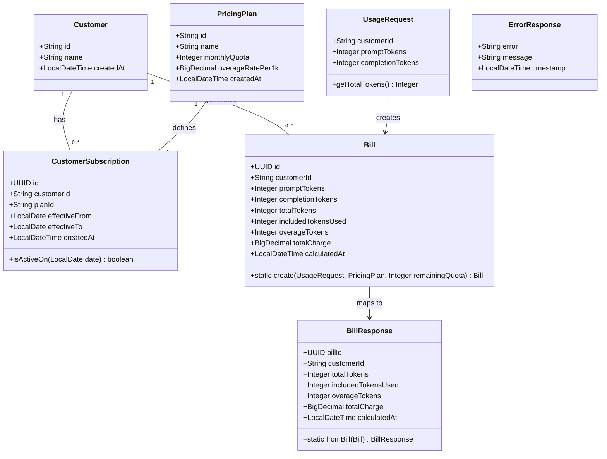

# Token Usage Billing API Implementation

## Requirements

Implement a billing calculation API that accepts token usage submissions, calculates charges based on quota-first consumption rules, and returns itemized bill details. The system must accurately bill LLM API customers by deducting usage from monthly included quotas before applying overage rates, ensuring revenue capture while providing transparent billing breakdowns.

## Entities



## Approach

1. **REST API Design**:
   - Single POST `/api/usage` endpoint accepting JSON payload
   - Request validation via Bean Validation annotations (`@Valid`, `@NotNull`, `@Min`)
   - HTTP 201 Created response with bill details on success
   - Standardized error responses for validation failures (400), not found (404), and business rule violations (422)

2. **Billing Calculation Strategy**:
   - Query-time aggregation for current month usage (correctness over performance)
   - Quota-first consumption: deduct from monthly quota before charging overage
   - BigDecimal arithmetic with HALF_UP rounding to 2 decimal places for charge calculation
   - Calendar month definition using UTC timezone for consistency

3. **Subscription Resolution**:
   - Find active subscription where current date falls within `effective_from` and `effective_to` (inclusive)
   - `effective_to = NULL` means subscription is active indefinitely
   - Fail explicitly with 422 if no active subscription found (safer for billing)

4. **Exception Handling Strategy**:
   - GlobalExceptionHandler with `@RestControllerAdvice` for unified error responses
   - Custom business exceptions extending RuntimeException
   - Structured ErrorResponse DTO for consistent client error format
   - Exception types: CustomerNotFoundException (404), NoActiveSubscriptionException (422), validation errors (400)

5. **Data Access Pattern**:
   - Spring Data JPA repositories for all entities
   - Custom query method in BillRepository for current month usage aggregation
   - Transactional service layer for billing calculation and persistence

## Structure

### Inheritance Relationships
1. `CustomerNotFoundException` extends `RuntimeException` for customer lookup failures
2. `NoActiveSubscriptionException` extends `RuntimeException` for subscription resolution failures
3. All entity classes are JPA `@Entity` annotated POJOs
4. Request/Response DTOs are simple data carriers with validation annotations

### Dependencies
1. `UsageController` depends on `BillingService` for business logic
2. `BillingService` depends on `CustomerRepository`, `CustomerSubscriptionRepository`, `BillRepository`
3. `GlobalExceptionHandler` handles exceptions from all controllers

### Layered Architecture
1. **Controller Layer**: HTTP request/response handling, input validation, delegates to service
2. **Service Layer**: Business logic orchestration, billing calculation, transaction management
3. **Repository Layer**: Spring Data JPA interfaces for data access
4. **Entity Layer**: JPA entities mapped to database tables
5. **DTO Layer**: Request/Response objects for API contract
6. **Exception Layer**: Custom exceptions and global handler for error responses

## Operations

### Create Entity - Customer
1. Responsibility: JPA entity mapping to `customers` table
2. Attributes:
   - `id`: String - Primary key (VARCHAR(50))
   - `name`: String - Customer name (VARCHAR(100))
   - `createdAt`: LocalDateTime - Creation timestamp
3. Annotations: `@Entity`, `@Table(name = "customers")`, `@Id`, `@Column`

### Create Entity - PricingPlan
1. Responsibility: JPA entity mapping to `pricing_plans` table
2. Attributes:
   - `id`: String - Primary key (VARCHAR(50))
   - `name`: String - Plan name (VARCHAR(100))
   - `monthlyQuota`: Integer - Monthly included tokens
   - `overageRatePer1k`: BigDecimal - Rate per 1000 overage tokens (DECIMAL(10,4))
   - `createdAt`: LocalDateTime - Creation timestamp
3. Annotations: `@Entity`, `@Table(name = "pricing_plans")`, `@Id`, `@Column`

### Create Entity - CustomerSubscription
1. Responsibility: JPA entity mapping to `customer_subscriptions` table, linking customers to plans
2. Attributes:
   - `id`: UUID - Primary key
   - `customerId`: String - Foreign key to customers
   - `planId`: String - Foreign key to pricing_plans
   - `effectiveFrom`: LocalDate - Subscription start date
   - `effectiveTo`: LocalDate - Subscription end date (nullable, null = indefinite)
   - `createdAt`: LocalDateTime - Creation timestamp
3. Methods:
   - `isActiveOn(LocalDate date)`: boolean
     - Logic: Return true if date >= effectiveFrom AND (effectiveTo is null OR date <= effectiveTo)
4. Relationships: `@ManyToOne` to Customer, `@ManyToOne` to PricingPlan
5. Annotations: `@Entity`, `@Table(name = "customer_subscriptions")`

### Create Entity - Bill
1. Responsibility: JPA entity mapping to `bills` table, storing usage and calculated charges
2. Attributes:
   - `id`: UUID - Primary key (generated)
   - `customerId`: String - Foreign key to customers
   - `promptTokens`: Integer - Input tokens submitted
   - `completionTokens`: Integer - Output tokens submitted
   - `totalTokens`: Integer - Sum of prompt + completion tokens
   - `includedTokensUsed`: Integer - Tokens deducted from quota
   - `overageTokens`: Integer - Tokens beyond quota
   - `totalCharge`: BigDecimal - Calculated charge (DECIMAL(10,2))
   - `calculatedAt`: LocalDateTime - Billing timestamp
3. Methods:
   - `static create(String customerId, int promptTokens, int completionTokens, int remainingQuota, BigDecimal overageRatePer1k)`: Bill
     - Logic:
       - Calculate totalTokens = promptTokens + completionTokens
       - Calculate includedTokensUsed = min(totalTokens, remainingQuota)
       - Calculate overageTokens = totalTokens - includedTokensUsed
       - Calculate totalCharge = (overageTokens / 1000.0) * overageRatePer1k, rounded HALF_UP to 2 decimals
       - Set calculatedAt to current UTC time
       - Generate UUID for id
       - Return new Bill instance
4. Annotations: `@Entity`, `@Table(name = "bills")`, `@PrePersist` for id generation

### Create DTO - UsageRequest
1. Responsibility: Input DTO for POST /api/usage endpoint
2. Attributes:
   - `customerId`: String - `@NotNull(message = "Customer ID is required")`
   - `promptTokens`: Integer - `@NotNull`, `@Min(value = 0, message = "Token count cannot be negative")`
   - `completionTokens`: Integer - `@NotNull`, `@Min(value = 0, message = "Token count cannot be negative")`
3. Methods:
   - `getTotalTokens()`: Integer - Returns promptTokens + completionTokens

### Create DTO - BillResponse
1. Responsibility: Output DTO for successful billing response
2. Attributes:
   - `billId`: UUID
   - `customerId`: String
   - `totalTokens`: Integer
   - `includedTokensUsed`: Integer
   - `overageTokens`: Integer
   - `totalCharge`: BigDecimal
   - `calculatedAt`: LocalDateTime
3. Methods:
   - `static fromBill(Bill bill)`: BillResponse
     - Logic: Map all fields from Bill entity to BillResponse

### Create DTO - ErrorResponse
1. Responsibility: Unified error response structure
2. Attributes:
   - `error`: String - Error type/code
   - `message`: String - Human-readable error message
   - `timestamp`: LocalDateTime - When error occurred
3. Constructors: All-args constructor, static factory method

### Create Repository - CustomerRepository
1. Responsibility: Data access for Customer entities
2. Interface: `extends JpaRepository<Customer, String>`
3. Methods: Use inherited `findById(String id)` - returns `Optional<Customer>`

### Create Repository - CustomerSubscriptionRepository
1. Responsibility: Data access for CustomerSubscription entities with active subscription lookup
2. Interface: `extends JpaRepository<CustomerSubscription, UUID>`
3. Methods:
   - `findByCustomerIdAndEffectiveFromLessThanEqualAndEffectiveToGreaterThanEqualOrEffectiveToIsNull(String customerId, LocalDate date, LocalDate date2)`: List<CustomerSubscription>
   - Or use `@Query` annotation:
     ```java
     @Query("SELECT cs FROM CustomerSubscription cs WHERE cs.customerId = :customerId " +
            "AND cs.effectiveFrom <= :date AND (cs.effectiveTo IS NULL OR cs.effectiveTo >= :date) " +
            "ORDER BY cs.createdAt DESC")
     List<CustomerSubscription> findActiveSubscriptions(@Param("customerId") String customerId, @Param("date") LocalDate date);
     ```

### Create Repository - BillRepository
1. Responsibility: Data access for Bill entities with monthly usage aggregation
2. Interface: `extends JpaRepository<Bill, UUID>`
3. Methods:
   - Custom query for current month usage:
     ```java
     @Query("SELECT COALESCE(SUM(b.includedTokensUsed), 0) FROM Bill b " +
            "WHERE b.customerId = :customerId " +
            "AND b.calculatedAt >= :monthStart AND b.calculatedAt < :monthEnd")
     Integer sumIncludedTokensUsedForMonth(@Param("customerId") String customerId,
                                           @Param("monthStart") LocalDateTime monthStart,
                                           @Param("monthEnd") LocalDateTime monthEnd);
     ```

### Create Exception - CustomerNotFoundException
1. Responsibility: Thrown when customer ID does not exist
2. Inheritance: extends RuntimeException
3. Attributes:
   - `customerId`: String - The ID that was not found
4. Constructors:
   - `CustomerNotFoundException(String customerId)`: Sets message "Customer not found"
5. HTTP Status: 404 Not Found

### Create Exception - NoActiveSubscriptionException
1. Responsibility: Thrown when customer has no active subscription
2. Inheritance: extends RuntimeException
3. Attributes:
   - `customerId`: String - The customer ID
4. Constructors:
   - `NoActiveSubscriptionException(String customerId)`: Sets message "No active subscription found"
5. HTTP Status: 422 Unprocessable Entity

### Create Exception Handler - GlobalExceptionHandler
1. Responsibility: Unified handling of all exceptions across controllers
2. Annotations: `@RestControllerAdvice`
3. Methods:
   - `handleCustomerNotFoundException(CustomerNotFoundException ex)`: ResponseEntity<ErrorResponse>
     - Logic: Return 404 with ErrorResponse containing "Customer not found"
   - `handleNoActiveSubscriptionException(NoActiveSubscriptionException ex)`: ResponseEntity<ErrorResponse>
     - Logic: Return 422 with ErrorResponse containing "No active subscription found"
   - `handleMethodArgumentNotValidException(MethodArgumentNotValidException ex)`: ResponseEntity<ErrorResponse>
     - Logic: Extract first validation error message, return 400 with ErrorResponse
   - `handleConstraintViolationException(ConstraintViolationException ex)`: ResponseEntity<ErrorResponse>
     - Logic: Return 400 with validation error message

### Create Service - BillingService
1. Responsibility: Orchestrate billing calculation and persistence
2. Annotations: `@Service`, `@Transactional`
3. Dependencies: `CustomerRepository`, `CustomerSubscriptionRepository`, `BillRepository`
4. Methods:
   - `calculateBill(UsageRequest request)`: Bill
     - Input Validation: Request is pre-validated by controller
     - Business Logic:
       1. Find customer by ID, throw CustomerNotFoundException if not found
       2. Get current date (UTC)
       3. Find active subscription for customer and current date
       4. If no active subscription, throw NoActiveSubscriptionException
       5. Get PricingPlan from subscription
       6. Calculate month boundaries (first day 00:00:00 to first day of next month 00:00:00, UTC)
       7. Query sum of includedTokensUsed for current month
       8. Calculate remainingQuota = monthlyQuota - currentMonthUsage
       9. Create Bill using Bill.create() with request data, remainingQuota, and overage rate
       10. Save Bill to repository
       11. Return saved Bill
     - Exception Handling: Let exceptions propagate to GlobalExceptionHandler
     - Return Value: Persisted Bill entity

### Create Controller - UsageController
1. Responsibility: Handle POST /api/usage endpoint
2. Annotations: `@RestController`, `@RequestMapping("/api")`
3. Dependencies: `BillingService`
4. Methods:
   - `submitUsage(@Valid @RequestBody UsageRequest request)`: ResponseEntity<BillResponse>
     - Annotations: `@PostMapping("/usage")`
     - Logic:
       1. Call billingService.calculateBill(request)
       2. Convert Bill to BillResponse using BillResponse.fromBill()
       3. Return ResponseEntity.status(HttpStatus.CREATED).body(billResponse)

## Norms

1. **Package Structure**:
   - `org.tw.token_billing.controller` - REST controllers
   - `org.tw.token_billing.service` - Business logic services
   - `org.tw.token_billing.repository` - Spring Data JPA repositories
   - `org.tw.token_billing.entity` - JPA entities
   - `org.tw.token_billing.dto` - Request/Response DTOs
   - `org.tw.token_billing.exception` - Custom exceptions and handlers

2. **Annotation Standards**:
   - Controllers: `@RestController`, `@RequestMapping`
   - Services: `@Service`, `@Transactional` on class or methods
   - Repositories: Extend `JpaRepository<Entity, IdType>`
   - Entities: `@Entity`, `@Table`, `@Id`, `@Column` with explicit naming
   - DTOs: `@NotNull`, `@Min`, `@Max` for validation
   - Exception Handler: `@RestControllerAdvice`, `@ExceptionHandler`

3. **Dependency Injection**:
   - Use constructor injection (Lombok `@RequiredArgsConstructor`)
   - Mark injected fields as `private final`

4. **Exception Handling**:
   - Custom exceptions extend RuntimeException
   - Include meaningful error messages and relevant context (e.g., customerId)
   - GlobalExceptionHandler returns consistent ErrorResponse structure
   - HTTP status codes: 400 (validation), 404 (not found), 422 (business rule violation)

5. **Data Types**:
   - Monetary values: `BigDecimal` with explicit scale
   - Timestamps: `LocalDateTime` in UTC
   - Dates: `LocalDate` for date-only fields
   - IDs: `UUID` for generated, `String` for external/business keys

6. **Naming Conventions**:
   - Entities: Singular noun (Customer, Bill)
   - Repositories: EntityNameRepository (CustomerRepository)
   - Services: DomainService (BillingService)
   - Controllers: DomainController (UsageController)
   - DTOs: ActionRequest/Response (UsageRequest, BillResponse)
   - Exceptions: ConditionException (CustomerNotFoundException)

7. **JSON Field Naming**:
   - Use camelCase for JSON properties
   - Match DTO field names to expected JSON structure

8. **Logging**:
   - Use SLF4J with Lombok `@Slf4j`
   - Log at INFO level for business operations
   - Log at ERROR level for exceptions in GlobalExceptionHandler

## Safeguards

1. **Functional Constraints**:
   - Customer ID must exist in database before usage submission
   - Customer must have an active subscription (current date within effective range)
   - Only POST method allowed on `/api/usage` endpoint
   - Response must include all fields specified in AC5: billId, customerId, totalTokens, includedTokensUsed, overageTokens, totalCharge, calculatedAt

2. **Input Validation Constraints**:
   - `customerId`: Required, non-null
   - `promptTokens`: Required, non-null, >= 0
   - `completionTokens`: Required, non-null, >= 0
   - Validation message for negative tokens: "Token count cannot be negative"

3. **Business Rule Constraints**:
   - Quota-first consumption: Always deduct from quota before charging overage
   - Remaining quota calculation: `monthlyQuota - sum(includedTokensUsed for current month)`
   - Overage charge formula: `(overageTokens / 1000) × overageRatePer1k`
   - Zero token submission is valid and produces $0.00 bill

4. **Data Integrity Constraints**:
   - Bill ID must be unique (UUID generation)
   - All Bill fields must be populated before persistence
   - `calculatedAt` timestamp must be set at creation time (UTC)

5. **Precision Constraints**:
   - Charge calculation uses `BigDecimal` to avoid floating-point errors
   - Final charge rounded to 2 decimal places using HALF_UP
   - Overage rate stored with 4 decimal precision (DECIMAL(10,4))

6. **Timezone Constraints**:
   - All timestamps stored and calculated in UTC
   - "Current month" defined as UTC calendar month
   - Month boundaries: First day 00:00:00 UTC to first day of next month 00:00:00 UTC

7. **HTTP Response Constraints**:
   - Success: HTTP 201 Created with BillResponse body
   - Customer not found: HTTP 404 with message "Customer not found"
   - Invalid token count: HTTP 400 with message "Token count cannot be negative"
   - No active subscription: HTTP 422 with message "No active subscription found"

8. **Exception Handling Constraints**:
   - All exceptions must be caught by GlobalExceptionHandler
   - Error responses must use consistent ErrorResponse structure
   - Exception messages must not expose internal system details

9. **Database Constraints**:
   - Must not modify existing schema (Flyway managed)
   - Must use existing table and column names from V1 migration
   - Foreign key relationships must be respected

10. **Performance Constraints**:
    - Current month aggregation query must use existing index on `bills(customer_id, calculated_at)`
    - No N+1 query issues in subscription/plan resolution
