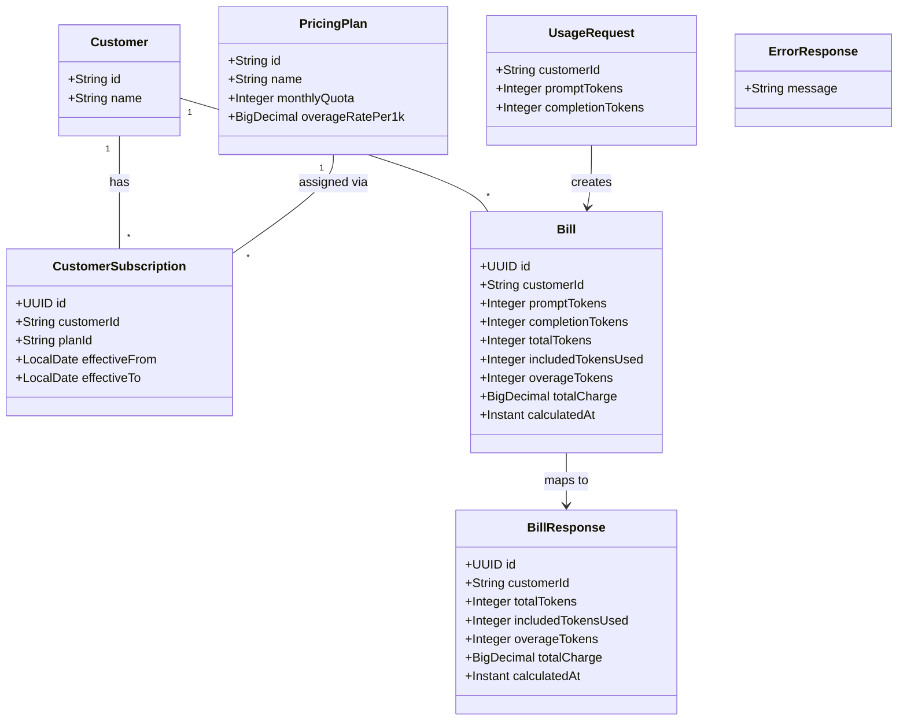

# Token Usage Billing API

## Requirements

Implement a REST endpoint that accepts LLM token usage for a customer, calculates a bill using monthly included quota and overage pricing, persists the result, and returns bill details. Validate customer existence and non-negative token counts with exact error messages. Derive current-month usage from previously persisted bills without implementing quota reset jobs or historical query APIs.

## Entities

Database tables already exist in Flyway V1 (`customers`, `pricing_plans`, `customer_subscriptions`, `bills`). JPA entities map to these tables; no new migrations for this feature.

## Approach

1. **API design**
   - Single endpoint `POST /api/usage` accepting JSON body with `customerId`, `promptTokens`, `completionTokens`.
   - Return HTTP 201 with `BillResponse` on success.
   - Return HTTP 404 or 400 with `{ "message": "..." }` for domain and validation errors.

2. **Technical implementation**
   - Spring Boot 3.5 layered architecture under `org.tw.token_billing`.
   - Spring Data JPA repositories for all four tables; `ddl-auto: validate` — entities must match V1 schema exactly.
   - Constructor injection throughout; Lombok for boilerplate on entities/DTOs where helpful.
   - `GlobalExceptionHandler` (`@RestControllerAdvice`) maps exceptions to HTTP status and `ErrorResponse`.
   - Billing date and calendar-month boundaries use **UTC** (`Instant` / `ZonedDateTime` with UTC).

3. **Business logic**
   - Verify customer exists; else 404 `"Customer not found"`.
   - Reject negative `promptTokens` or `completionTokens` with 400 `"Token count cannot be negative"` (exact message required by AC2).
   - Resolve active subscription for customer on billing date (today UTC): `effective_from <= today` AND (`effective_to` IS NULL OR `effective_to >= today`). If none, 404 `"No active subscription found"`.
   - Load pricing plan for subscription; read `monthly_quota` and `overage_rate_per_1k`.
   - Sum `total_tokens` from existing `bills` for customer where `calculated_at` falls in current UTC calendar month (exclude the bill being created).
   - `remainingQuota = max(0, monthlyQuota - currentMonthUsage)`.
   - `totalTokens = promptTokens + completionTokens`.
   - `includedTokensUsed = min(totalTokens, remainingQuota)`.
   - `overageTokens = totalTokens - includedTokensUsed`.
   - `totalCharge = (overageTokens / 1000) * overageRatePer1k` using `BigDecimal`, scale 2, `HALF_UP`.
   - Generate UUID for bill id; set `calculatedAt` to current instant; persist and return response.

4. **Validation strategy**
   - `@NotNull` on request fields for missing values → 400 with field error or generic validation message (not covered by AC exact text).
   - Negative token check must produce exact AC2 message — use `@Min(value = 0, message = "Token count cannot be negative")` on both token fields OR equivalent manual check before other validation.

## Structure

### Inheritance Relationships

1. `CustomerNotFoundException` extends `RuntimeException`
2. `NoActiveSubscriptionException` extends `RuntimeException`
3. JPA entities extend no custom base class; use `@Entity` mapped to existing tables

### Dependencies

1. `UsageController` injects `BillingService`
2. `BillingServiceImpl` injects `CustomerRepository`, `CustomerSubscriptionRepository`, `PricingPlanRepository`, `BillRepository`
3. `GlobalExceptionHandler` handles `CustomerNotFoundException`, `NoActiveSubscriptionException`, `MethodArgumentNotValidException`, `ConstraintViolationException`

### Layered Architecture

1. **Controller layer** (`controller`): HTTP mapping, request validation trigger, response status codes
2. **Service layer** (`service`): billing orchestration and calculation; `@Transactional` on submit method
3. **Repository layer** (`repository`): Spring Data JPA interfaces and custom query for monthly usage sum
4. **Entity layer** (`entity`): JPA mappings to V1 tables
5. **DTO layer** (`dto`): request/response records and error payload
6. **Exception layer** (`exception`): domain exceptions and global handler

## Operations

### Create JPA Entity - Customer

1. Responsibility: Map `customers` table
2. Package: `org.tw.token_billing.entity`
3. Attributes: `id` String PK, `name` String, `createdAt` Instant (optional mapping if column exists)
4. Annotations: `@Entity`, `@Table(name = "customers")`, `@Id` on id
5. Constraints: align column names with V1 schema

### Create JPA Entity - PricingPlan

1. Responsibility: Map `pricing_plans` table
2. Package: `org.tw.token_billing.entity`
3. Attributes: `id` String PK, `name` String, `monthlyQuota` Integer column `monthly_quota`, `overageRatePer1k` BigDecimal column `overage_rate_per_1k`, `createdAt` Instant optional
4. Annotations: `@Entity`, `@Table(name = "pricing_plans")`

### Create JPA Entity - CustomerSubscription

1. Responsibility: Map `customer_subscriptions` table
2. Package: `org.tw.token_billing.entity`
3. Attributes: `id` UUID PK, `customerId` String, `planId` String, `effectiveFrom` LocalDate, `effectiveTo` LocalDate nullable, `createdAt` Instant optional
4. Annotations: `@Entity`, `@Table(name = "customer_subscriptions")`

### Create JPA Entity - Bill

1. Responsibility: Map `bills` table
2. Package: `org.tw.token_billing.entity`
3. Attributes: `id` UUID, `customerId` String, `promptTokens`, `completionTokens`, `totalTokens`, `includedTokensUsed`, `overageTokens` Integer; `totalCharge` BigDecimal; `calculatedAt` Instant
4. Annotations: `@Entity`, `@Table(name = "bills")`; id assigned in service before persist (no auto-generation required if app sets UUID)

### Create Repository - CustomerRepository

1. Responsibility: Lookup customer by id
2. Package: `org.tw.token_billing.repository`
3. Interface extends `JpaRepository<Customer, String>`
4. Method: `existsById(String id)` or `findById` for existence check

### Create Repository - CustomerSubscriptionRepository

1. Responsibility: Find active subscription for customer
2. Package: `org.tw.token_billing.repository`
3. Method: `findActiveByCustomerId(String customerId, LocalDate asOfDate)` — query where `customer_id = ?` AND `effective_from <= asOfDate` AND (`effective_to` IS NULL OR `effective_to >= asOfDate`) ORDER BY `effective_from` DESC LIMIT 1 (or `findFirst...` Spring Data naming)

### Create Repository - PricingPlanRepository

1. Responsibility: Load plan by id
2. Package: `org.tw.token_billing.repository`
3. Extends `JpaRepository<PricingPlan, String>`

### Create Repository - BillRepository

1. Responsibility: Persist bills and aggregate monthly usage
2. Package: `org.tw.token_billing.repository`
3. Methods:
   - `save(Bill bill)`
   - `sumTotalTokensByCustomerIdAndCalculatedAtBetween(String customerId, Instant monthStart, Instant monthEnd)` returning `Long` or `Integer` (coalesce null to 0)

### Create DTO - UsageRequest

1. Package: `org.tw.token_billing.dto`
2. Attributes: `customerId` String, `promptTokens` Integer, `completionTokens` Integer
3. Validation: `@NotNull` on all fields; `@Min(value = 0, message = "Token count cannot be negative")` on both token fields
4. Annotations: use record or class with validation annotations; enable `@Valid` on controller parameter

### Create DTO - BillResponse

1. Package: `org.tw.token_billing.dto`
2. Attributes: `id` UUID, `customerId` String, `totalTokens` Integer, `includedTokensUsed` Integer, `overageTokens` Integer, `totalCharge` BigDecimal, `calculatedAt` Instant
3. Static factory: `from(Bill bill)` mapping entity to response

### Create DTO - ErrorResponse

1. Package: `org.tw.token_billing.dto`
2. Attributes: `message` String
3. Used for all error responses

### Create Exception - CustomerNotFoundException

1. Package: `org.tw.token_billing.exception`
2. Message: `"Customer not found"` (fixed string, no parameters exposed to client)

### Create Exception - NoActiveSubscriptionException

1. Package: `org.tw.token_billing.exception`
2. Message: `"No active subscription found"`

### Create GlobalExceptionHandler

1. Package: `org.tw.token_billing.exception`
2. Annotations: `@RestControllerAdvice`
3. Handlers:
   - `CustomerNotFoundException` → 404, body `{ "message": "Customer not found" }`
   - `NoActiveSubscriptionException` → 404, body `{ "message": "No active subscription found" }`
   - `MethodArgumentNotValidException` → 400; if any field error message equals `"Token count cannot be negative"`, respond with `{ "message": "Token count cannot be negative" }`; otherwise `{ "message": "<first field error or generic validation message>" }`
4. Response type: `ResponseEntity<ErrorResponse>`

### Create BillingService Interface

1. Package: `org.tw.token_billing.service`
2. Method: `BillResponse submitUsage(UsageRequest request)` — validates business rules, calculates, persists, returns response

### Implement BillingService - BillingServiceImpl

1. Package: `org.tw.token_billing.service`
2. Annotations: `@Service`, `@Transactional` on `submitUsage`
3. Logic steps:
   - If `!customerRepository.existsById(request.customerId())`, throw `CustomerNotFoundException`
   - `asOfDate = LocalDate.now(ZoneOffset.UTC)`
   - Load active subscription; if empty, throw `NoActiveSubscriptionException`
   - Load pricing plan by subscription.planId
   - Compute UTC month start/end instants for `calculated_at` range query
   - `currentMonthUsage = billRepository.sum...` (default 0)
   - `remainingQuota = max(0, plan.monthlyQuota - currentMonthUsage)`
   - Calculate tokens and charges per Approach section using BigDecimal
   - Build Bill with new UUID, persist, return `BillResponse.from(bill)`
4. Edge cases: zero tokens allowed (all zeros, $0 charge); full overage when remainingQuota is 0

### Create UsageController

1. Package: `org.tw.token_billing.controller`
2. Annotations: `@RestController`, `@RequestMapping("/api")`
3. Endpoint: `@PostMapping("/usage")` method `submitUsage(@Valid @RequestBody UsageRequest request)`
4. Inject `BillingService`; return `ResponseEntity.status(HttpStatus.CREATED).body(response)`

## Norms

1. **Annotations**: `@RestController`, `@Service`, `@Transactional`, `@Entity`, `@Table`, `@Valid`, `@RestControllerAdvice`, `@ExceptionHandler`
2. **Dependency injection**: constructor injection only; no field injection
3. **Exception handling**: all API errors return `ErrorResponse` JSON with single `message` field
4. **Validation**: Jakarta Bean Validation on `UsageRequest`; controller uses `@Valid`
5. **Logging**: optional `@Slf4j` info log on bill creation with customerId and bill id
6. **Money and math**: use `BigDecimal` for charges and rates; integer types for token counts
7. **JSON naming**: Jackson default camelCase for request/response
8. **Timestamps**: serialize `calculatedAt` as ISO-8601 UTC string
9. **Package root**: all new classes under `org.tw.token_billing.*`

## Safeguards

1. **Functional**
   - Only implement `POST /api/usage`; no customer CRUD, no bill list/get endpoints, no quota reset scheduler
   - Each successful request inserts exactly one `bills` row
   - AC3 example: quota 100000, 60000 used, submit 30000 → included 30000, overage 0, charge 0.00
   - AC4 example: quota 100000, 80000 used, rate 0.02, submit 50000 → included 20000, overage 30000, charge 0.60

2. **API contract**
   - Success: HTTP **201**
   - Unknown customer: HTTP **404**, message exactly **`Customer not found`**
   - Negative tokens: HTTP **400**, message exactly **`Token count cannot be negative`**
   - No active subscription: HTTP **404**, message **`No active subscription found`**
   - 201 response body must include: `id`, `customerId`, `totalTokens`, `includedTokensUsed`, `overageTokens`, `totalCharge`, `calculatedAt`

3. **Business rules**
   - `totalTokens = promptTokens + completionTokens`
   - Quota consumed before overage: `includedTokensUsed = min(totalTokens, remainingQuota)`
   - `overageTokens = totalTokens - includedTokensUsed`
   - `totalCharge = (overageTokens / 1000) * overageRatePer1k`, scale 2 decimal places
   - Current-month usage = sum of existing bills' `total_tokens` for customer within current UTC calendar month (bills table only)

4. **Data integrity**
   - Do not add Flyway migrations; map exactly to V1 schema
   - UUID bill ids generated in application layer before insert
   - Foreign keys satisfied: customer must exist before insert

5. **Technical**
   - Application must start with `ddl-auto: validate` against PostgreSQL
   - No schema changes via Hibernate
   - Concurrent requests for same customer: acceptable without locking for MVP (document only)

6. **Testing alignment**
   - Manual and automated tests use seed customer `CUST-001` (PLAN-STARTER: 100000 quota, 0.02/1K) for AC3/AC4 scenarios
   - Prior-month usage for AC tests achieved by inserting bill rows with `calculated_at` in current month before submission

## Acceptance Criteria Traceability

| AC | Scenario | Implementation |
|----|----------|----------------|
| 1 | Customer not found | `CustomerRepository.existsById` → `CustomerNotFoundException` → 404 |
| 2 | Negative tokens | `@Min(0, message="Token count cannot be negative")` + handler → 400 |
| 3 | Within quota | Monthly usage sum + quota-first math in `BillingServiceImpl` |
| 4 | Overage charge $0.60 | BigDecimal overage formula with plan rate |
| 5 | 201 bill payload | `BillResponse` returned from controller with all required fields |
