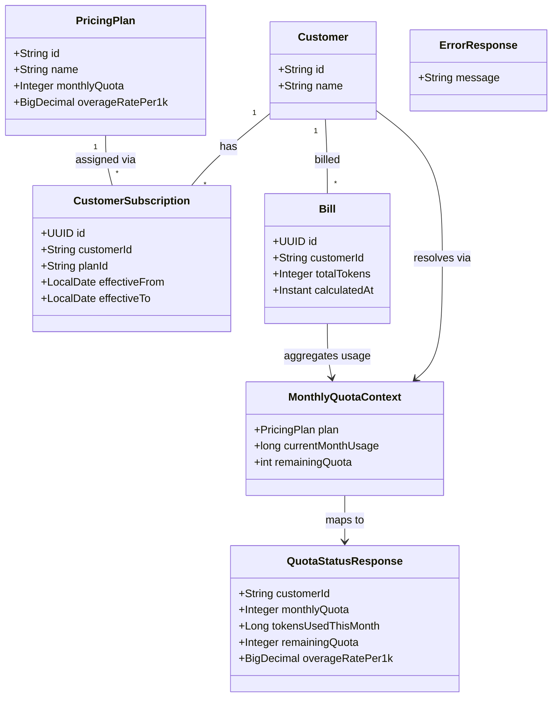

# Quota Status Lookup API

## Requirements

Expose a read-only REST endpoint so API clients can inspect a customer's current monthly quota status before submitting token usage. Return the active plan's monthly quota, tokens consumed in the current calendar month, remaining quota (floored at zero), and overage rate using the same subscription resolution and monthly usage aggregation rules as POST /api/usage. Reject unknown customers with the same 404 behavior as billing. Do not persist data, expose bill history, or add customer CRUD.

## Entities

Existing JPA entities and repositories from Story 1 are reused unchanged. `MonthlyQuotaContext` is an internal service-layer record (not persisted). No new database tables or Flyway migrations.

## Approach

1. **API design**
   - Single read endpoint: `GET /api/quota/{customerId}`.
   - Return HTTP 200 with `QuotaStatusResponse` on success.
   - Return HTTP 404 with `{ "message": "..." }` for unknown customer or missing active subscription (same messages as billing).
   - No request body; customer ID is a required path variable.

2. **Technical implementation**
   - Extend existing Spring Boot layered architecture under `org.tw.token_billing`.
   - Add `QuotaController` for the read endpoint; keep `UsageController` unchanged for POST /api/usage.
   - Extend `BillingService` / `BillingServiceImpl` with a read method — same domain, same repositories; avoid a parallel service class for one operation.
   - Extract shared subscription resolution and monthly usage aggregation into a private helper used by both `submitUsage` and `getQuotaStatus` so quota lookup and billing cannot drift.
   - Reuse existing `CustomerNotFoundException`, `NoActiveSubscriptionException`, and `GlobalExceptionHandler` — no new exception types.
   - Calendar-month boundaries and lookup date use **UTC** (`ZoneOffset.UTC`), identical to billing.

3. **Business logic**
   - Verify customer exists; else throw `CustomerNotFoundException` (404 `"Customer not found"`).
   - Resolve active subscription for customer on lookup date (today UTC): `effective_from <= today` AND (`effective_to` IS NULL OR `effective_to >= today`), most recent `effective_from`. If none, throw `NoActiveSubscriptionException` (404 `"No active subscription found"`).
   - Load pricing plan; if missing, throw `NoActiveSubscriptionException`.
   - Sum `total_tokens` from `bills` for customer where `calculated_at` is in current UTC calendar month using half-open interval `[monthStart, monthEnd)`.
   - `remainingQuota = max(0, monthlyQuota - currentMonthUsage)`.
   - Map to response: `customerId`, `monthlyQuota`, `tokensUsedThisMonth`, `remainingQuota`, `overageRatePer1k`.
   - Do not persist, mutate, or return bill rows.

4. **Refactor rationale**
   - `BillingServiceImpl` currently inlines subscription lookup, month window, and usage sum in `submitUsage`. Extract to `resolveMonthlyQuotaContext(String customerId)` returning `MonthlyQuotaContext(plan, currentMonthUsage, remainingQuota)`.
   - `submitUsage` calls helper then applies token/charge math and persist.
   - `getQuotaStatus` calls helper then maps to `QuotaStatusResponse`.
   - Prevents logic drift — primary risk identified in analysis.

## Structure

### Inheritance Relationships

1. No new exception classes; reuse Story 1 exceptions extending `RuntimeException`
2. `MonthlyQuotaContext` is a package-private record in the service layer
3. JPA entities unchanged

### Dependencies

1. `QuotaController` injects `BillingService`
2. `BillingServiceImpl` injects `CustomerRepository`, `CustomerSubscriptionRepository`, `PricingPlanRepository`, `BillRepository` (unchanged)
3. `BillingServiceImpl.resolveMonthlyQuotaContext` used by both `submitUsage` and `getQuotaStatus`
4. `GlobalExceptionHandler` already maps domain exceptions — no changes required unless handler gaps exist

### Layered Architecture

1. **Controller layer** (`controller`): `QuotaController` maps GET path variable, returns 200 response
2. **Service layer** (`service`): `BillingServiceImpl` adds read method; shared private helper for quota context
3. **Repository layer** (`repository`): unchanged — reuse `BillRepository.sumTotalTokensByCustomerIdAndCalculatedAtBetween` and subscription lookup
4. **DTO layer** (`dto`): new `QuotaStatusResponse` record
5. **Exception layer** (`exception`): unchanged

## Operations

### Create Internal Record - MonthlyQuotaContext

1. Responsibility: Hold resolved plan, aggregated usage, and computed remaining quota for reuse by billing write and quota read paths
2. Package: `org.tw.token_billing.service` (package-private record)
3. Components: `PricingPlan plan`, `long currentMonthUsage`, `int remainingQuota`
4. No Spring annotations; constructed only inside `BillingServiceImpl`

### Refactor BillingServiceImpl - resolveMonthlyQuotaContext

1. Responsibility: Shared subscription resolution, UTC month window, usage aggregation, remaining quota calculation
2. Package: `org.tw.token_billing.service`
3. Method signature: private `MonthlyQuotaContext resolveMonthlyQuotaContext(String customerId)`
4. Step-by-step logic:
   - If `!customerRepository.existsById(customerId)`, throw `CustomerNotFoundException`
   - `asOfDate = LocalDate.now(ZoneOffset.UTC)`
   - Load active subscription via `customerSubscriptionRepository.findActiveByCustomerId(customerId, asOfDate)`; if empty, throw `NoActiveSubscriptionException`
   - Load plan via `pricingPlanRepository.findById(subscription.getPlanId())`; if empty, throw `NoActiveSubscriptionException`
   - Compute UTC month bounds: `monthStart = asOfDate.withDayOfMonth(1).atStartOfDay(ZoneOffset.UTC).toInstant()`, `monthEnd = asOfDate.plusMonths(1).withDayOfMonth(1).atStartOfDay(ZoneOffset.UTC).toInstant()`
   - `currentMonthUsage = billRepository.sumTotalTokensByCustomerIdAndCalculatedAtBetween(customerId, monthStart, monthEnd)` (defaults to 0)
   - `remainingQuota = max(0, plan.getMonthlyQuota() - (int) currentMonthUsage)`
   - Return new `MonthlyQuotaContext(plan, currentMonthUsage, remainingQuota)`
5. Refactor existing `submitUsage` to call this helper instead of duplicating lookup/aggregation logic

### Create DTO - QuotaStatusResponse

1. Package: `org.tw.token_billing.dto`
2. Record attributes: `customerId` String, `monthlyQuota` Integer, `tokensUsedThisMonth` Long, `remainingQuota` Integer, `overageRatePer1k` BigDecimal
3. Static factory: `from(String customerId, MonthlyQuotaContext context)` mapping plan quota/rate and context usage/remaining fields
4. No validation annotations (no request body)

### Extend BillingService Interface

1. Package: `org.tw.token_billing.service`
2. Add method: `QuotaStatusResponse getQuotaStatus(String customerId)`

### Implement BillingService - getQuotaStatus in BillingServiceImpl

1. Package: `org.tw.token_billing.service`
2. Annotations: `@Service` (class level, already present); **no** `@Transactional` on read method
3. Logic:
   - `MonthlyQuotaContext context = resolveMonthlyQuotaContext(customerId)`
   - Return `QuotaStatusResponse.from(customerId, context)`
4. Edge cases: zero usage returns full remaining quota; over-quota usage returns remaining 0; does not expose individual bills

### Create QuotaController

1. Package: `org.tw.token_billing.controller`
2. Annotations: `@RestController`, `@RequestMapping("/api")`
3. Constructor inject `BillingService`
4. Endpoint: `@GetMapping("/quota/{customerId}")` method `getQuotaStatus(@PathVariable String customerId)`
5. Return `ResponseEntity.ok(billingService.getQuotaStatus(customerId))` — HTTP 200
6. Domain exceptions propagate to `GlobalExceptionHandler`

### Add Unit Tests - BillingServiceImpl quota methods

1. Package: `org.tw.token_billing.service` test mirror
2. Extend `BillingServiceImplTest` with cases:
   - Unknown customer throws `CustomerNotFoundException`
   - 60K used, 100K quota → remaining 40K, rate 0.02 (AC2)
   - 120K used → remaining 0 (AC3)
   - 0 usage → remaining equals monthly quota (AC4)
3. Mock repositories; stub `sumTotalTokensByCustomerIdAndCalculatedAtBetween` return values

### Add Controller Test - QuotaControllerTest

1. Package: `org.tw.token_billing.controller`
2. Annotations: `@WebMvcTest(QuotaController.class)`, `@Import(GlobalExceptionHandler.class)`
3. Mock `BillingService`
4. Cases:
   - 404 unknown customer with exact message `"Customer not found"`
   - 200 success with jsonPath assertions for all five response fields matching AC2 example values

## Norms

1. **Annotations**: `@RestController`, `@GetMapping`, `@PathVariable`, `@Service` on impl; constructor injection only
2. **Exception handling**: reuse existing `GlobalExceptionHandler`; all errors return `ErrorResponse` with single `message` field
3. **JSON naming**: Jackson camelCase — `customerId`, `monthlyQuota`, `tokensUsedThisMonth`, `remainingQuota`, `overageRatePer1k` (aligns with existing entity/DTO field naming from Story 1)
4. **Money/rates**: `overageRatePer1k` as `BigDecimal`; serialize as JSON number preserving up to 4 decimal places (matches DB `DECIMAL(10,4)`); e.g. `0.02` for PLAN-STARTER
5. **Token counts**: `monthlyQuota` and `remainingQuota` as Integer; `tokensUsedThisMonth` as Long (matches repository sum return type, avoids overflow for large aggregates)
6. **Timestamps**: not included in quota response (snapshot is implicit "as of now"; no `calculatedAt` field)
7. **Logging**: optional `@Slf4j` info log on quota lookup with customerId
8. **Package root**: all new classes under `org.tw.token_billing.*`
9. **Read vs write**: do not add `@Transactional` to read method; do not modify `submitUsage` transaction behavior

## Safeguards

1. **Functional**
   - Only implement `GET /api/quota/{customerId}`; no customer CRUD, no bill list/history endpoints, no quota reset scheduler
   - Read path must not insert or update any database rows
   - Response must not contain bill IDs, bill lists, charges, or per-bill breakdowns (AC6)
   - AC2 example: CUST-001, quota 100000, 60000 used → remaining 40000, overageRatePer1k 0.02
   - AC3 example: 120000 used → remaining 0
   - AC4 example: 0 used → remaining 100000

2. **API contract**
   - Success: HTTP **200**
   - Unknown customer: HTTP **404**, message exactly **`Customer not found`**
   - No active subscription (or missing plan): HTTP **404**, message exactly **`No active subscription found`**
   - 200 response body must include: `customerId`, `monthlyQuota`, `tokensUsedThisMonth`, `remainingQuota`, `overageRatePer1k`
   - Must not include: `id`, `totalCharge`, `calculatedAt`, bill arrays, or any bill-level fields

3. **Business rules**
   - Current-month usage = sum of `total_tokens` from existing bills for customer within current UTC calendar month (half-open `[monthStart, monthEnd)`)
   - `remainingQuota = max(0, monthlyQuota - tokensUsedThisMonth)`
   - Active subscription resolution identical to POST /api/usage (AC5)
   - Lookup date = today UTC

4. **Data integrity**
   - No Flyway migrations; no schema changes
   - Reuse existing repositories and queries only

5. **Technical**
   - Shared `resolveMonthlyQuotaContext` must be the single source for month window and usage sum used by both endpoints
   - Refactoring `submitUsage` must not change existing billing behavior or test expectations
   - Concurrent GET during POST: point-in-time read acceptable without locking (MVP)

6. **Testing alignment**
   - Use seed customer `CUST-001` (PLAN-STARTER: 100000 quota, 0.0200/1K) for AC examples
   - Integration or unit tests seed bill rows with `calculated_at` in current UTC month to control usage totals

## Acceptance Criteria Traceability

| AC | Scenario | Implementation |
|----|----------|----------------|
| 1 | Customer not found | `resolveMonthlyQuotaContext` → `CustomerNotFoundException` → 404 |
| 2 | Within quota snapshot | Shared usage sum + response mapping in `getQuotaStatus` |
| 3 | Remaining floored at zero | `max(0, monthlyQuota - usage)` in shared helper |
| 4 | No usage this month | Sum returns 0; remaining equals monthly quota |
| 5 | Active subscription alignment | Same `findActiveByCustomerId` + plan load as billing |
| 6 | No bill history | `QuotaStatusResponse` exposes aggregates only; no bill fields |
